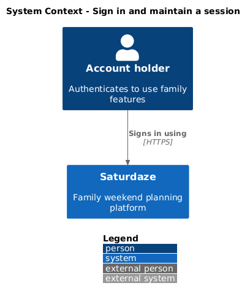
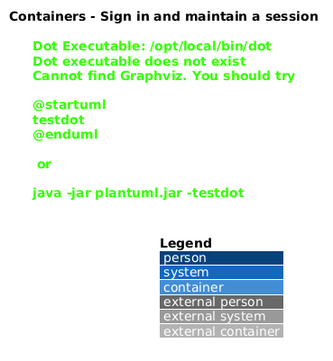
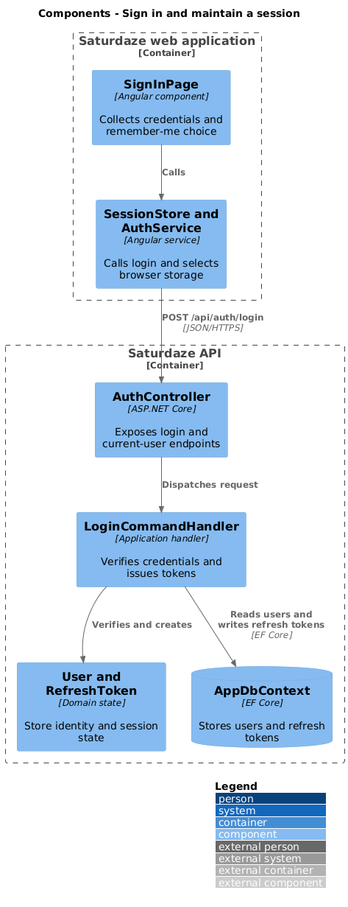
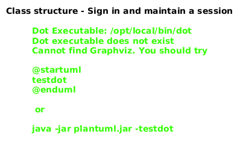
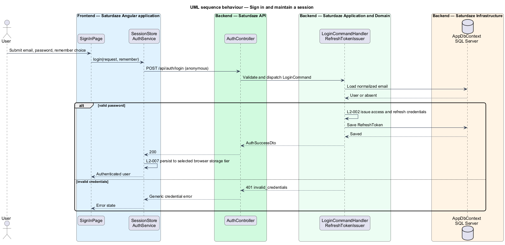
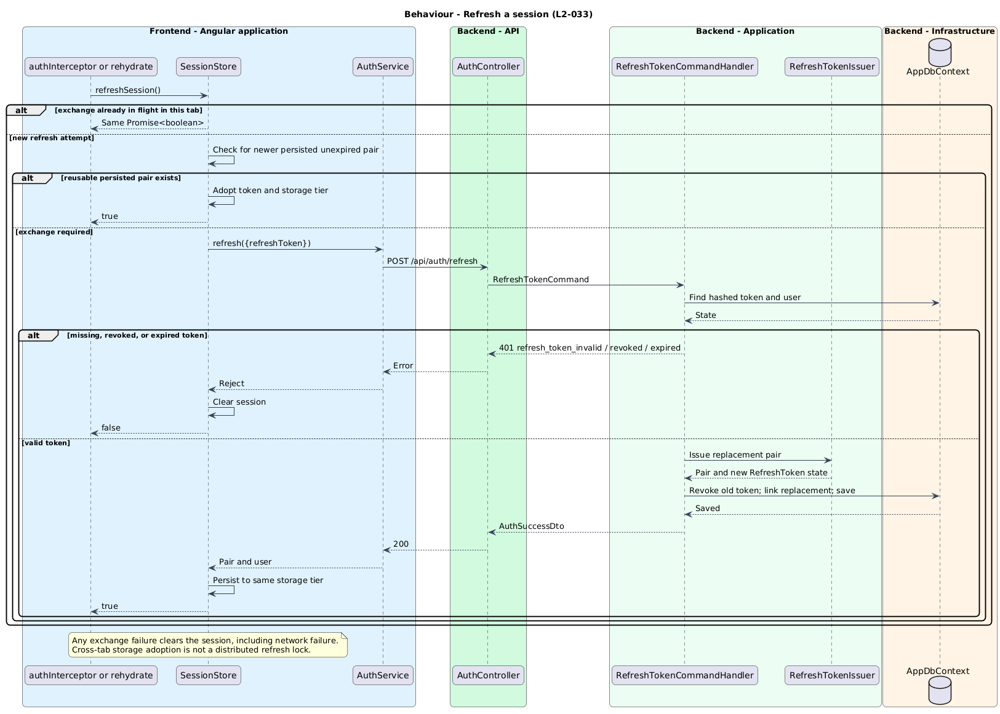

# Sign in and maintain a session

## Overview

Saturdaze is a web application that plans personalized family weekends. Sign-in exchanges valid credentials for access and refresh tokens and restores the authenticated application shell.

*remembered session* — token session persisted across browser restarts in local storage

`SessionStore` selects durable or tab-scoped browser storage from the remember-me choice. `LoginCommandHandler` verifies the password and creates a new `RefreshToken` for the session.

## Description

`SignInPage` at `/sign-in` submits email/password and the remember choice to `SessionStore.login()`. `AuthService` calls `POST /api/auth/login`; `LoginCommandHandler` verifies the password and uses `RefreshTokenIssuer` to issue the pair.

Credential failures return 401 `invalid_credentials`. Successful login stores `sd.auth.token` in local storage or session storage; the browser owns this persistence decision. Independent logins can create independent sessions.

`SessionStore.rehydrate()` loads saved credentials and resolves the user through `/api/auth/me`, or refreshes a token within 60 seconds of expiry. `refreshSession()` shares one in-flight exchange among concurrent callers and persists the replacement to the same storage tier.

`RefreshTokenCommandHandler` revokes the presented token and links it to its replacement. `authInterceptor` retries an eligible 401 once and excludes token exchange and logout from refresh loops.

Any refresh failure currently clears the session, including transient network failures. Cross-tab adoption can reuse an already-persisted replacement but does not provide a distributed lock.

## Requirements

The following L2 requirements refine the cited L1 capabilities. Implementation gaps stated in Description do not waive these obligations.

| L2 ID | Refines (L1) | Requirement |
|-------|--------------|-------------|
| `L2-002` | `L1-001` | The system shall authenticate a user by `Email` + `Password`, issue a fresh access token + refresh token on every successful login, and return a generic 401 error on any credential failure (without distinguishing "no such user" from "wrong password"). |
| `L2-007` | `L1-001` | The login form's "remember me" toggle shall select between durable persistence (`localStorage`) and session-only persistence (`sessionStorage`) for the access and refresh tokens. |
| `L2-033` | `L1-012` | Every issued refresh token shall record `CreatedAtUtc`, `ExpiresAtUtc` (14 days), `CreatedByIp` (when available), and on use at `POST /api/auth/refresh` shall be revoked and replaced by a new token, with the presented row\'s `ReplacedByTokenId` pointing to the replacement. |

## Diagrams

### System context

The context view identifies the person using this capability and the Saturdaze system that owns the resulting state.

### Containers

The container view follows the interaction from the Angular web application through the API to SQL Server.

### Components

The component view names the page, client service, controller, handler, domain type, and persistence boundary involved in this slice.

### Class structure

The class view shows the request path and the state types used by the feature.

### Behaviour — sign in and select token persistence

The sequence view traces the primary behaviour to `L2-002` and `L2-007`. Its alternate path shows how the feature returns a controlled failure.

### Behaviour — rotate and persist a session

This sequence records the current implementation, including its failure boundary.

