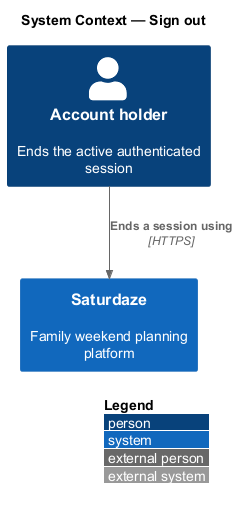
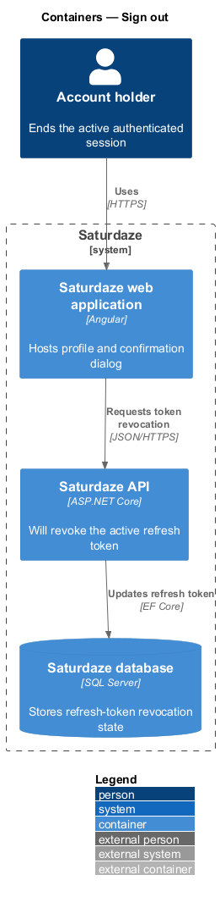
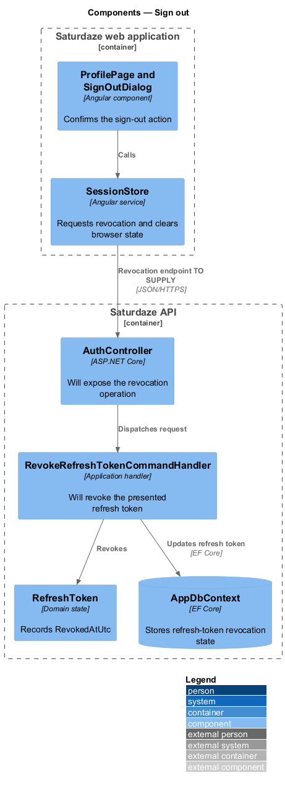
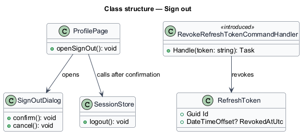
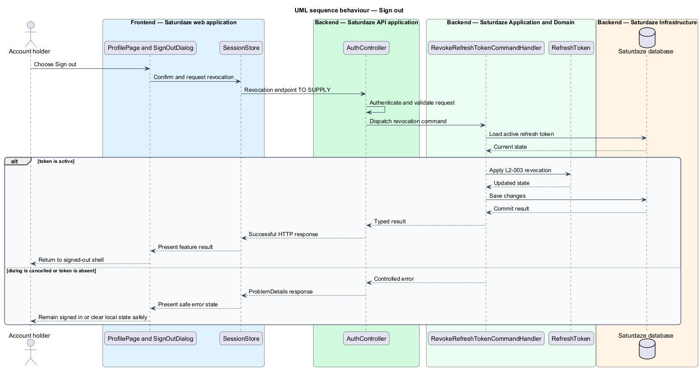

# Sign out

## Overview

Saturdaze is a web application that plans personalized family weekends. Sign-out ends the browser session and revokes the active refresh token so it cannot create another access token.

*token revocation* — server-side invalidation of token material before its natural expiry

The profile page opens `SignOutDialog` before `SessionStore.logout()` clears client state. Server-side token revocation remains an explicit design gap.

## Description

The feature forms a vertical slice across the Angular application, the ASP.NET Core API, application handlers, domain state, and SQL Server persistence.

- **`ProfilePage`** — Angular profile page that opens the confirmation dialog.
- **`SignOutDialog`** — Angular CDK dialog that returns `confirm` only after deliberate approval.
- **`SessionStore`** — Client state service whose existing `logout()` method clears stored session data.
- **`AuthController`** — Existing authentication controller that will host the revocation operation.
- **`RevokeRefreshTokenCommandHandler`** — Application handler introduced by this design to revoke the active `RefreshToken`.
- **`RefreshToken`** — Domain entity whose `RevokedAtUtc` field records invalidation.

The server endpoint and request contract for revocation are `<TO SUPPLY>`. The current `SessionStore.logout()` performs client-only clearing.

## Requirements

The feature realizes the following level-2 (L2) requirements. Each row cites the level-1 (L1) capability refined by the requirement.

| L2 ID | Refines (L1) | Requirement |
|-------|--------------|-------------|
| `L2-003` | `L1-001` | A signed-in user must be able to sign out via a dialog from the profile page, after which their refresh token is revoked and stored token material is cleared from the client. |

## Diagrams

### System context

The context view identifies the person using this capability and the Saturdaze system that owns the resulting state.

### Containers

The container view follows the interaction from the Angular web application through the API to SQL Server.

### Components

The component view names the page, client service, controller, handler, domain type, and persistence boundary involved in this slice.

### Class structure

The class view shows the request path and the state types used by the feature.

### Behaviour — confirm and revoke a session

The sequence view traces the primary behaviour to `L2-003`. Its alternate path shows how the feature returns a controlled failure.

