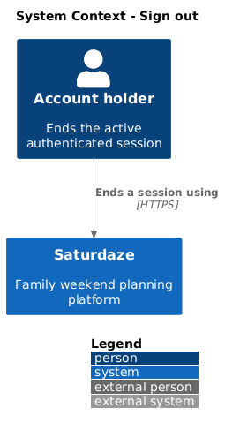
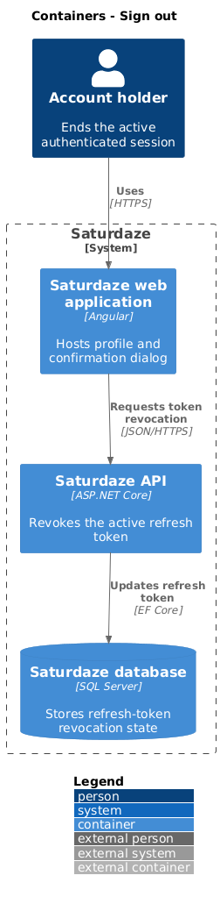
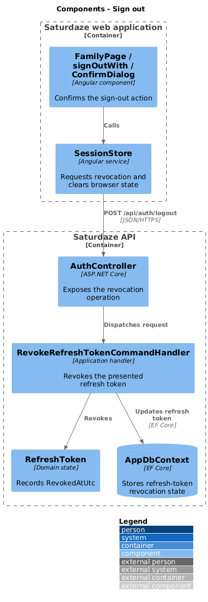
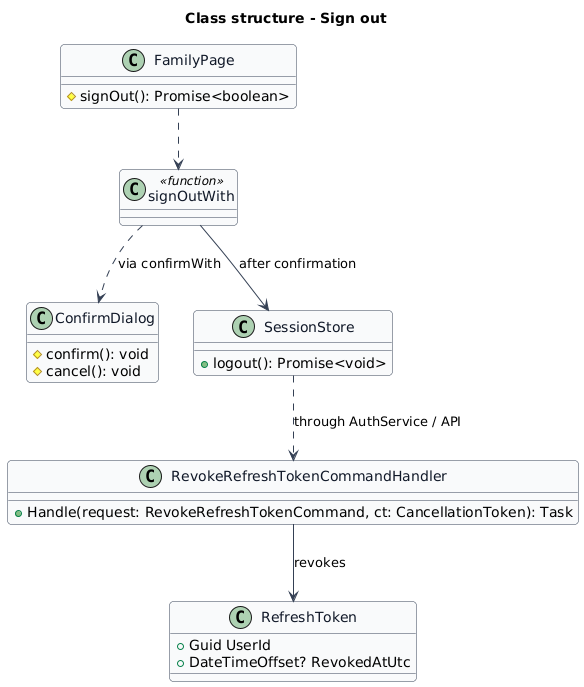
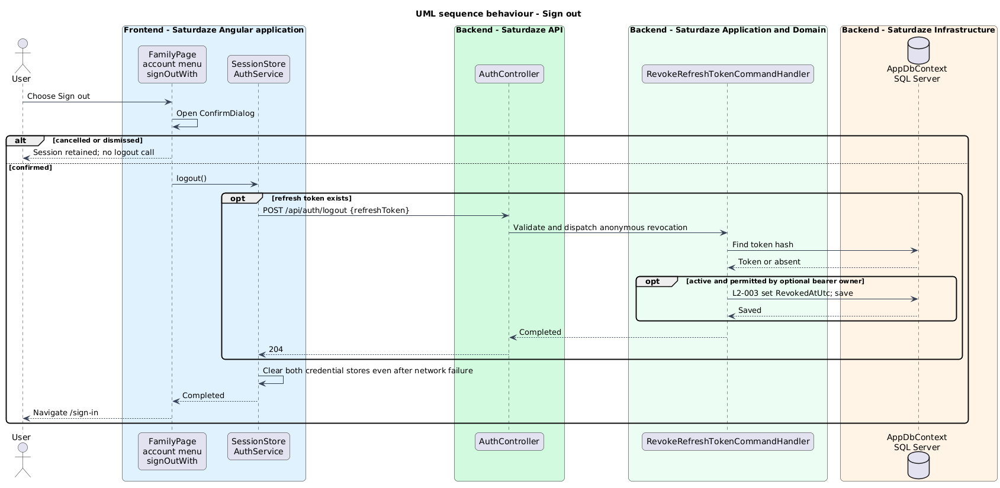

# Sign out

## Overview

Saturdaze is a web application that plans personalized family weekends. Sign-out ends the browser session and revokes the active refresh token so it cannot create another access token.

*token revocation* — server-side invalidation of token material before its natural expiry

The Family page or account menu opens `ConfirmDialog`; on confirmation, `SessionStore.logout()` posts the refresh token to `POST /api/auth/logout` (best effort) and then clears client state.

## Description

`FamilyPage` and the account menu invoke the shared `signOutWith()` helper. It opens `ConfirmDialog` through `confirmWith()`, calls `SessionStore.logout()` after confirmation, and navigates to `/sign-in`.

`SessionStore.logout()` sends the current refresh token to `POST /api/auth/logout` before clearing both storage tiers and current-user state. Revocation is best effort; local sign-out still completes if the network call fails.

`AuthController.Logout()` dispatches `RevokeRefreshTokenCommand`. The handler revokes a matching active token and tolerates missing or already-revoked values; a supplied bearer restricts revocation to its owner.

The anonymous endpoint returns 204 for well-formed requests regardless of token existence. Input validation can still reject malformed requests. Cancel or dismissal leaves the session intact.

Remembered email is retained. An already-issued access JWT remains valid until expiry; sign-out revokes refresh capability rather than immediately blacklisting access JWTs.

## Requirements

The following L2 requirements refine the cited L1 capabilities. Implementation gaps stated in Description do not waive these obligations.

| L2 ID | Refines (L1) | Requirement |
|-------|--------------|-------------|
| `L2-003` | `L1-001` | A signed-in user shall be able to sign out via a confirmation dialog from the Family page or account menu, after which their refresh token is revoked and stored token material is cleared from the client. |

## Diagrams

### System context

The context view identifies the person using this capability and the Saturdaze system that owns the resulting state.

### Containers

The container view follows the interaction from the Angular web application through the API to SQL Server.

### Components

The component view names the page, client service, controller, handler, domain type, and persistence boundary involved in this slice.

### Class structure

The class view shows the request path and the state types used by the feature.

### Behaviour — confirm and revoke a session

The sequence view traces the primary behaviour to `L2-003`. Its alternate path shows how the feature returns a controlled failure.

