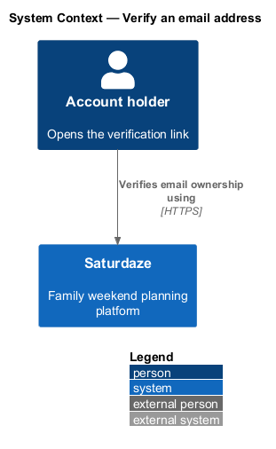
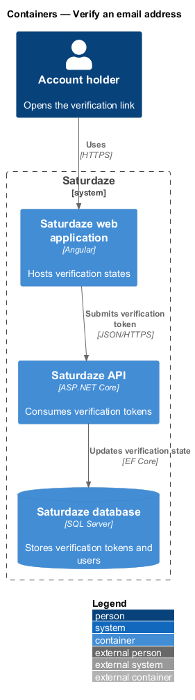
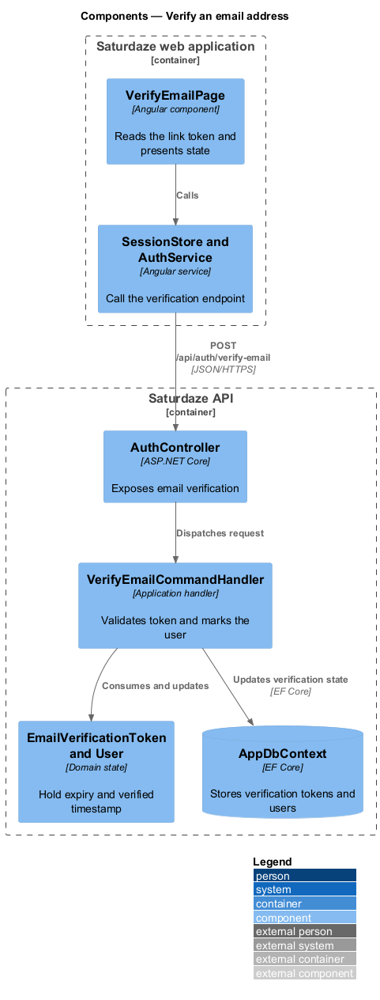
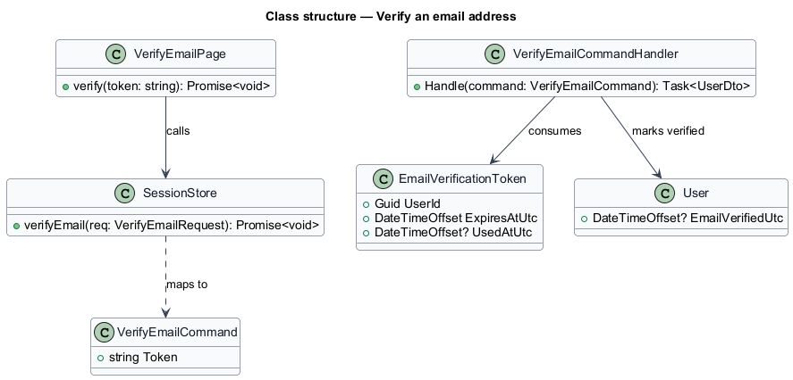
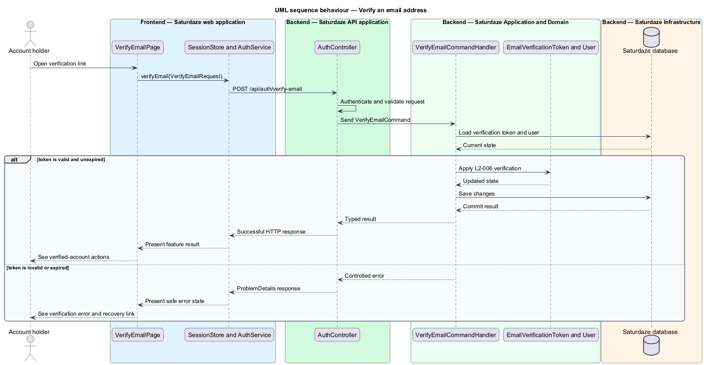

# Verify an email address

## Overview

Saturdaze is a web application that plans personalized family weekends. Email verification proves that the account holder controls the address registered to the account.

*verification token* — single-use credential linking an email-verification request to one user

`VerifyEmailPage` reads the query token and delegates to `SessionStore`. The handler marks `User.EmailVerifiedUtc` only when the token is valid and unexpired.

## Description

The feature forms a vertical slice across the Angular application, the ASP.NET Core API, application handlers, domain state, and SQL Server persistence.

- **`VerifyEmailPage`** — Angular page that presents loading, success, and invalid-token states.
- **`SessionStore and AuthService`** — Client services that submit the verification token.
- **`AuthController`** — API controller exposing `POST /api/auth/verify-email`.
- **`VerifyEmailCommand`** — Request record carrying the verification token.
- **`VerifyEmailCommandHandler`** — Application handler that validates and consumes the token.
- **`EmailVerificationToken and User`** — Domain entities holding token expiry and verified time.

## Requirements

The feature realizes the following level-2 (L2) requirements. Each row cites the level-1 (L1) capability refined by the requirement.

| L2 ID | Refines (L1) | Requirement |
|-------|--------------|-------------|
| `L2-006` | `L1-001` | The system must accept a verification token, mark the corresponding user as verified, and surface either a success or error state on `/verify-email`. |

## Diagrams

### System context

The context view identifies the person using this capability and the Saturdaze system that owns the resulting state.

### Containers

The container view follows the interaction from the Angular web application through the API to SQL Server.

### Components

The component view names the page, client service, controller, handler, domain type, and persistence boundary involved in this slice.

### Class structure

The class view shows the request path and the state types used by the feature.

### Behaviour — consume an email-verification token

The sequence view traces the primary behaviour to `L2-006`. Its alternate path shows how the feature returns a controlled failure.

