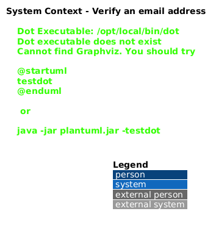
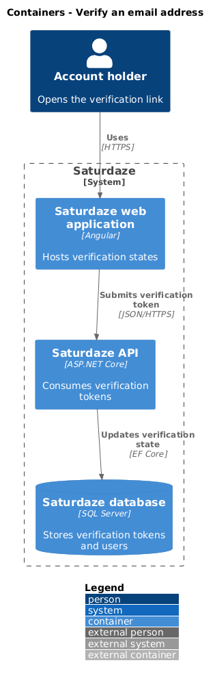
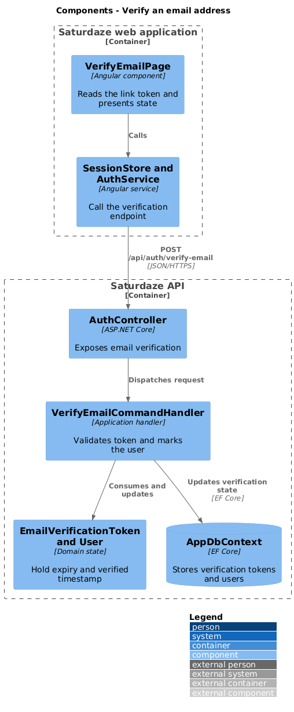
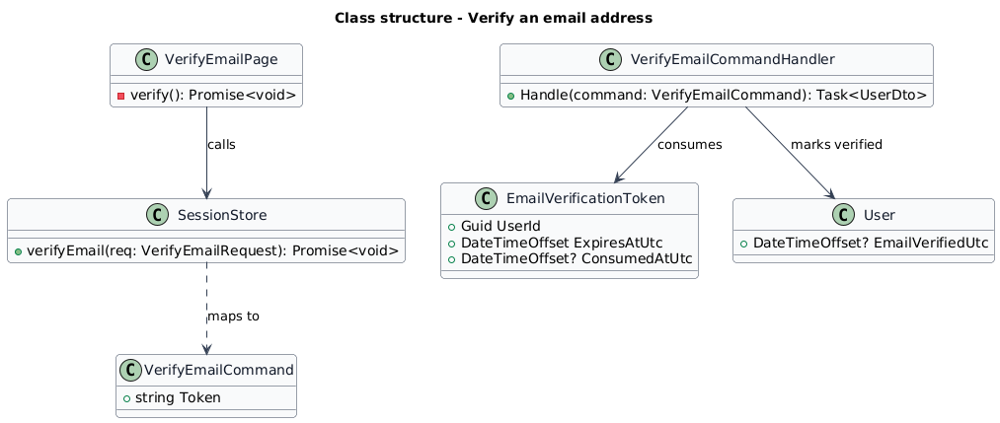
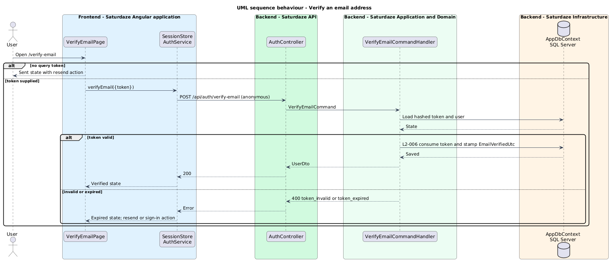

# Verify an email address

## Overview

Saturdaze is a web application that plans personalized family weekends. Email verification proves that the account holder controls the address registered to the account.

*verification token* — single-use credential linking an email-verification request to one user

`VerifyEmailPage` reads the query token and delegates to `SessionStore`. The handler marks `User.EmailVerifiedUtc` only when the token is valid and unexpired.

## Description

`VerifyEmailPage` has no authentication guard. Without a token it shows sent state; with a token it calls `SessionStore.verifyEmail()` and displays verifying, verified, or expired state.

`AuthController` dispatches `VerifyEmailCommand`; `VerifyEmailCommandHandler` validates `EmailVerificationToken`, consumes it, and sets `User.EmailVerifiedUtc`. The client defensively treats `email_already_verified` as success, but the current verify handler does not emit it: reused tokens return `token_invalid`, and valid unconsumed tokens preserve an existing verification timestamp.

The verified state links to `/family` and `/weekend`. `resend()` calls the resend-verification endpoint and applies a 60-second browser cooldown.

Verification delivery remains unimplemented. Development and Testing expose delivery metadata through `AuthController`; production does not send mail.

## Requirements

The following L2 requirements refine the cited L1 capabilities. Implementation gaps stated in Description do not waive these obligations.

| L2 ID | Refines (L1) | Requirement |
|-------|--------------|-------------|
| `L2-006` | `L1-001` | The system shall accept a verification token, mark the corresponding user as verified, and surface either a success or error state on `/verify-email`. |

## Diagrams

### System context

The context view identifies the person using this capability and the Saturdaze system that owns the resulting state.

### Containers

The container view follows the interaction from the Angular web application through the API to SQL Server.

### Components

The component view names the page, client service, controller, handler, domain type, and persistence boundary involved in this slice.

### Class structure

The class view shows the request path and the state types used by the feature.

### Behaviour — consume an email-verification token

The sequence view traces the primary behaviour to `L2-006`. Its alternate path shows how the feature returns a controlled failure.

