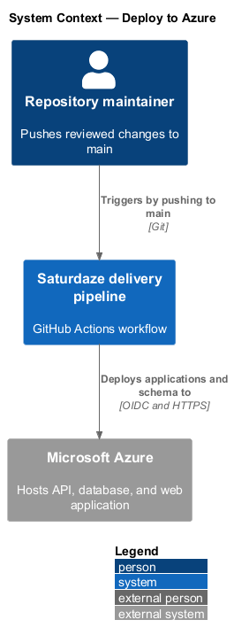
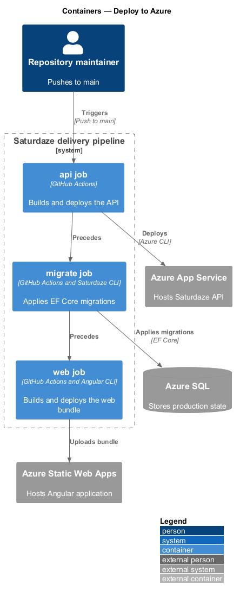
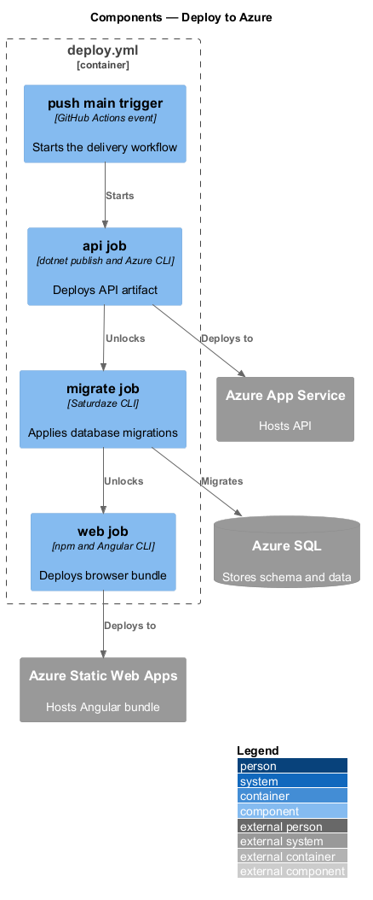
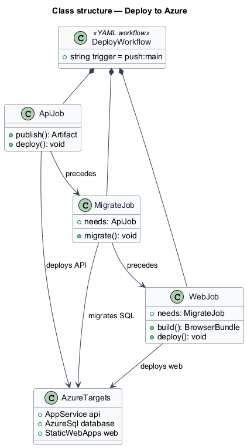
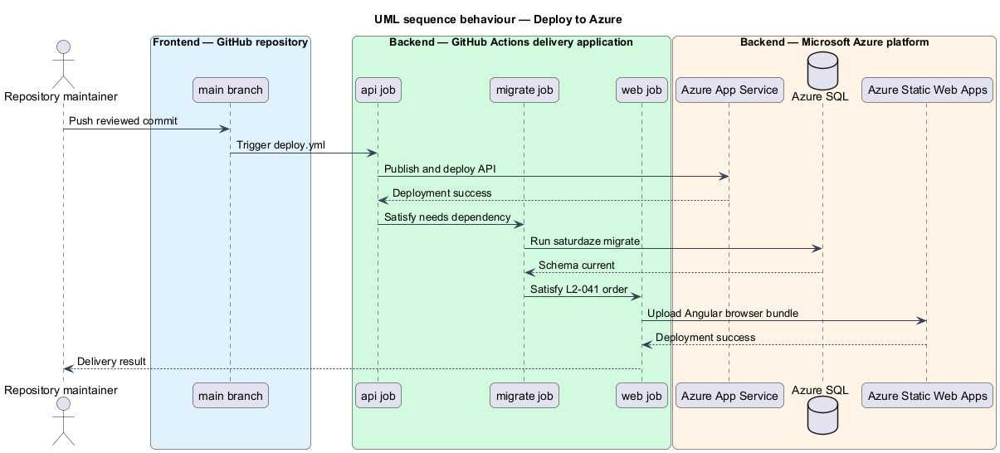

# Deploy to Azure

## Overview

Saturdaze combines an Angular web application, an ASP.NET Core API, SQL Server persistence, and administrative delivery tooling. The delivery pipeline publishes the API, advances the Azure SQL schema, and publishes the Angular application after a push to the main branch.

*idempotent migration* — schema update that produces the same current state when rerun

`.github/workflows/deploy.yml` builds the API, runs the CLI migration command, builds Angular, and uploads the browser bundle to Azure Static Web Apps.

## Description

The feature crosses the application and platform boundaries needed to deliver its observable outcome.

- **`api job`** — GitHub Actions job that publishes and deploys `Saturdaze.Api` to Azure App Service.
- **`migrate job`** — GitHub Actions job that runs `saturdaze migrate` against Azure SQL after the API job.
- **`web job`** — GitHub Actions job that builds Angular and uploads the browser bundle.
- **`Azure login`** — OIDC authentication step for Azure App Service deployment.
- **`Saturdaze CLI`** — Administrative executable used to apply EF Core migrations.
- **`Azure platform targets`** — App Service, Azure SQL, and Static Web Apps resources receiving artifacts or schema updates.

The current `web` job has no `needs: migrate` dependency and may run before API deployment or migration. The dependency needed to enforce the order in `L2-041` is `<TO SUPPLY>`.
## Requirements

The feature realizes the following level-2 (L2) requirements. Each row cites the level-1 (L1) capability refined by the requirement.

| L2 ID | Refines (L1) | Requirement |
|-------|--------------|-------------|
| `L2-041` | `L1-016` | The `.github/workflows/deploy.yml` workflow must fire on every push to `main` and must produce, in order: a successfully deployed API on Azure App Service, applied EF migrations against Azure SQL, and a successfully deployed Angular bundle on Azure Static Web Apps. |

## Diagrams

### System context

The context view identifies the person using or operating the capability and the participating system boundary.

### Containers

The container view shows the deployable applications, platform services, or data stores that carry the feature.

### Components

The component view names the runtime or delivery components that implement the slice.

### Class structure

The class view shows the code and configuration relationships that control the feature.

### Behaviour — deliver API, schema, and web in order

The sequence view traces the primary behaviour to `L2-041`. Its alternate path shows the controlled non-success outcome.

