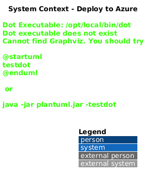
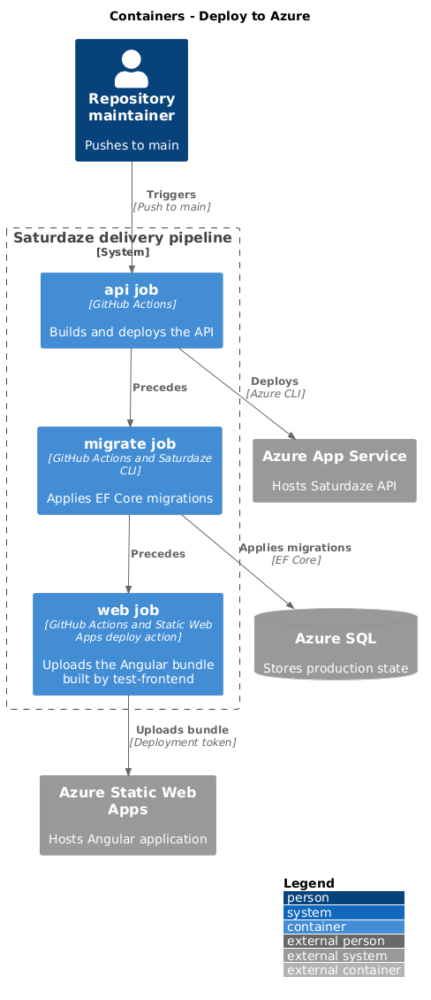
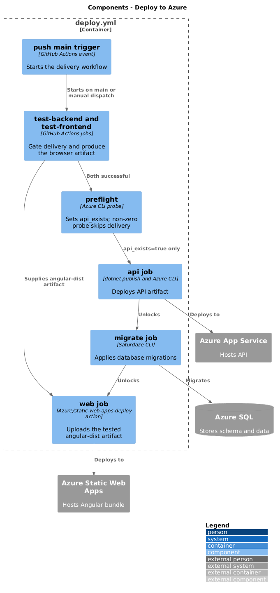
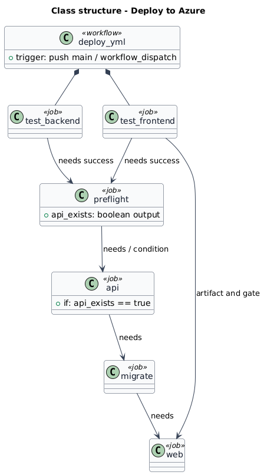
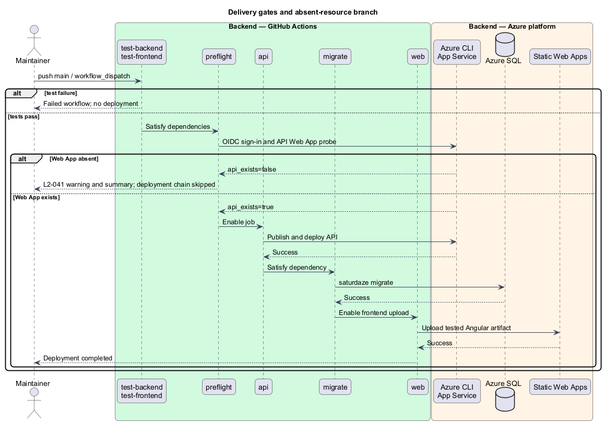

# Deploy to Azure

## Overview

Saturdaze combines an Angular web application, an ASP.NET Core API, SQL Server persistence, and administrative delivery tooling. The delivery pipeline publishes the API, advances the Azure SQL schema, and publishes the Angular application after a push to the main branch, passing tests, and a successful resource preflight.

*idempotent migration* — schema update that produces the same current state when rerun

`.github/workflows/deploy.yml` builds the API, runs the CLI migration command, builds Angular, and uploads the browser bundle to Azure Static Web Apps.

## Description

`.github/workflows/deploy.yml` runs backend tests on Windows with LocalDB and frontend build/tests before `preflight`. The preflight signs into Azure through OIDC and probes the configured API Web App.

When `api_exists=true`, `api` publishes and deploys the API. `migrate` depends on successful API deployment, and `web` depends on migration plus frontend gates before uploading the existing Angular artifact.

When the API Web App is absent, preflight emits a warning and summary, and the API/migration/web chain is skipped. Azure login failures fail preflight. The current probe treats every non-zero `az webapp show` result as an absent resource; authorization and transient probe errors can therefore also skip delivery. This classification is an implementation gap.

`.github/workflows/ci.yml` runs validation on pull requests and non-main pushes. `eng/Start-FreshStack.ps1` is local tooling, not part of this hosted deployment.

The ingestion worker and WebJob source artifacts are available, but this workflow does not package or deploy them.

## Requirements

The following L2 requirements refine the cited L1 capabilities. Implementation gaps stated in Description do not waive these obligations.

| L2 ID | Refines (L1) | Requirement |
|-------|--------------|-------------|
| `L2-041` | `L1-016` | The `.github/workflows/deploy.yml` workflow shall run test gates and a resource preflight on every push to `main`. When the configured API Web App exists, it shall deploy the API, apply EF migrations, and deploy the Angular bundle in order. When the resource is absent, it shall skip those three jobs with a visible summary and warning. |

## Diagrams

### System context

The context view identifies the person using or operating the capability and the participating system boundary.

### Containers

The container view shows the deployable applications, platform services, or data stores that carry the feature.

### Components

The component view names the runtime or delivery components that implement the slice.

### Class structure

The class view shows selected code and configuration relationships. Cancellation parameters and unrelated members are omitted.

### Behaviour — deliver API, schema, and web in order

The sequence view traces the primary behaviour to `L2-041`. Its alternate path shows the controlled non-success outcome.

