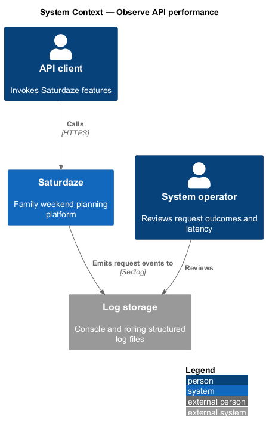
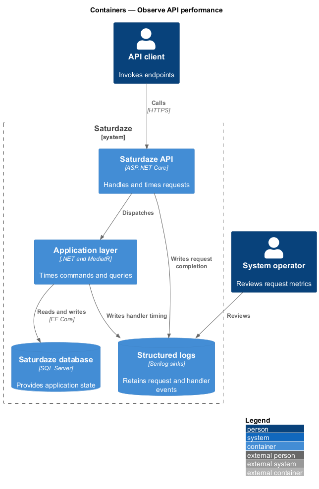
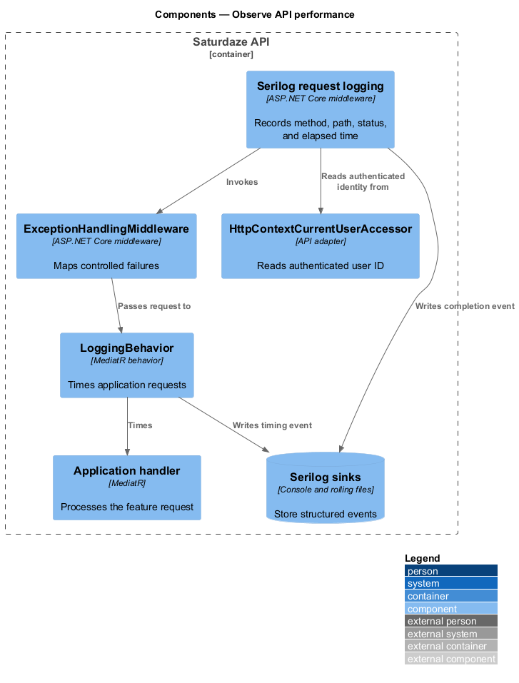
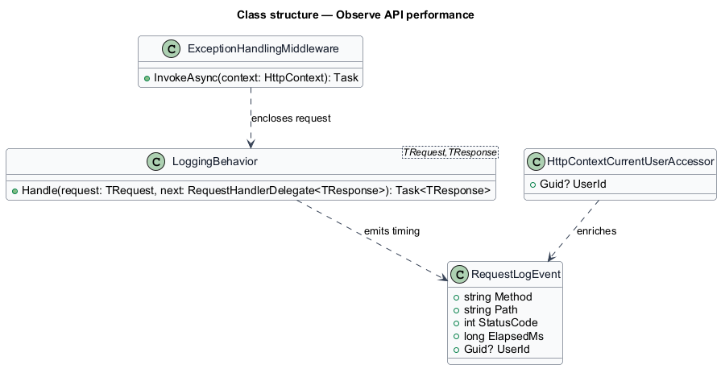
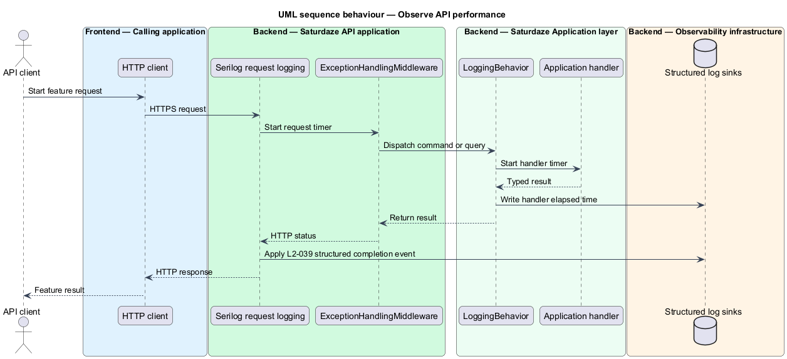

# Observe API performance

## Overview

Saturdaze combines an Angular web application, an ASP.NET Core API, SQL Server persistence, and administrative delivery tooling. Request observability records timing and outcome data for every API request and exposes whether interactive latency budgets are being met.

*p95 latency* — response duration below which 95 percent of measured requests complete

`UseSerilogRequestLogging()` records HTTP method, path, status, and elapsed time. `LoggingBehavior` records application request duration around each MediatR handler.

## Description

The feature crosses the application and platform boundaries needed to deliver its observable outcome.

- **`Serilog request logging middleware`** — ASP.NET Core middleware that emits one completion event per HTTP request.
- **`LoggingBehavior`** — MediatR pipeline behavior that times application commands and queries.
- **`HttpContextCurrentUserAccessor`** — API adapter that reads the authenticated user identifier.
- **`ExceptionHandlingMiddleware`** — API middleware that converts known failures to non-leaky problem responses.
- **`Console and rolling file sinks`** — Configured Serilog destinations for structured events.
- **`Performance verification`** — Load-test and percentile evaluation mechanism whose concrete tool is `<TO SUPPLY>`.

The request-completion event is enriched with `UserId` from the bearer's `sub` claim (`UseSerilogRequestLogging` in `Program.cs`). Request logging is registered outside `ExceptionHandlingMiddleware`, so a handled 401/404/409 is logged with that status rather than as an error-level 500 with a stack trace. Automated p95 budget evaluation for `L2-034` is still `<TO SUPPLY>`.
## Requirements

The feature realizes the following level-2 (L2) requirements. Each row cites the level-1 (L1) capability refined by the requirement.

| L2 ID | Refines (L1) | Requirement |
|-------|--------------|-------------|
| `L2-034` | `L1-013` | Read endpoints must respond within 500 ms p95 on warm cache; write endpoints within 1000 ms p95; weekend generation within 2000 ms p95. |
| `L2-039` | `L1-015` | Every API request must produce a Serilog log entry with method, path, status code, elapsed milliseconds, and (when authenticated) the user ID — but never the bearer token, password, or password hash. |

## Diagrams

### System context

The context view identifies the person using or operating the capability and the participating system boundary.

### Containers

The container view shows the deployable applications, platform services, or data stores that carry the feature.

### Components

The component view names the runtime or delivery components that implement the slice.

### Class structure

The class view shows the code and configuration relationships that control the feature.

### Behaviour — record and assess an API request

The sequence view traces the primary behaviour to `L2-034` and `L2-039`. Its alternate path shows the controlled non-success outcome.

