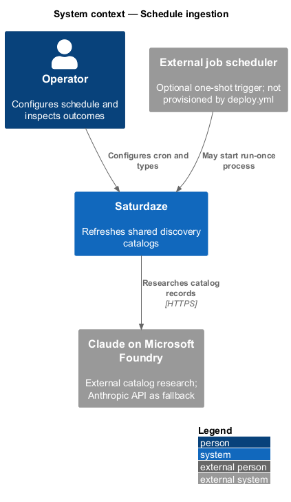
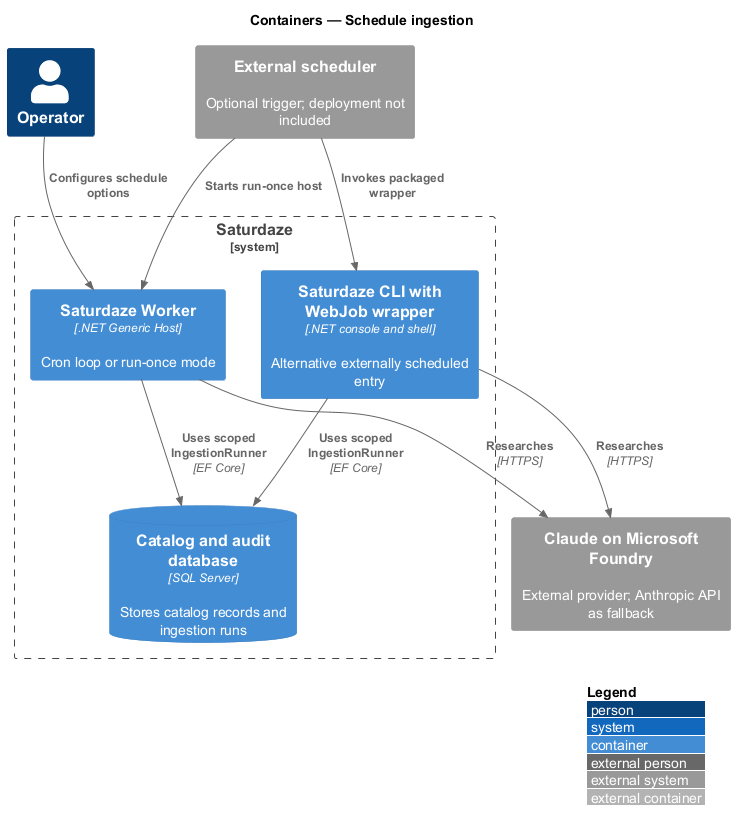
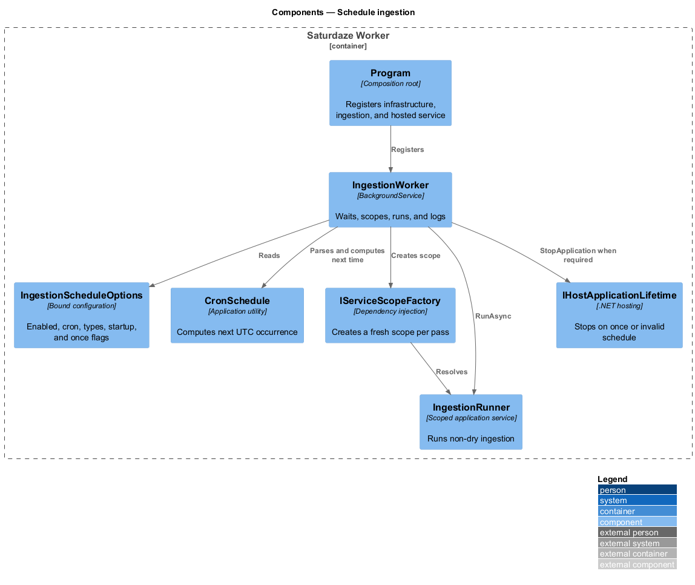
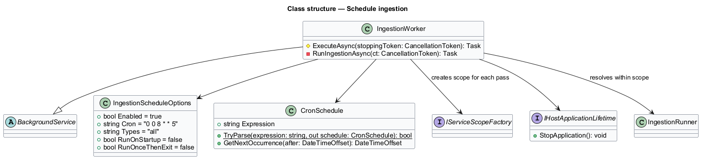
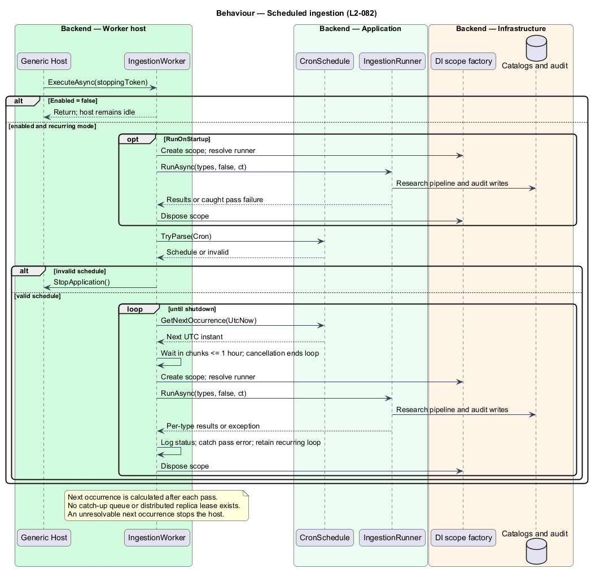
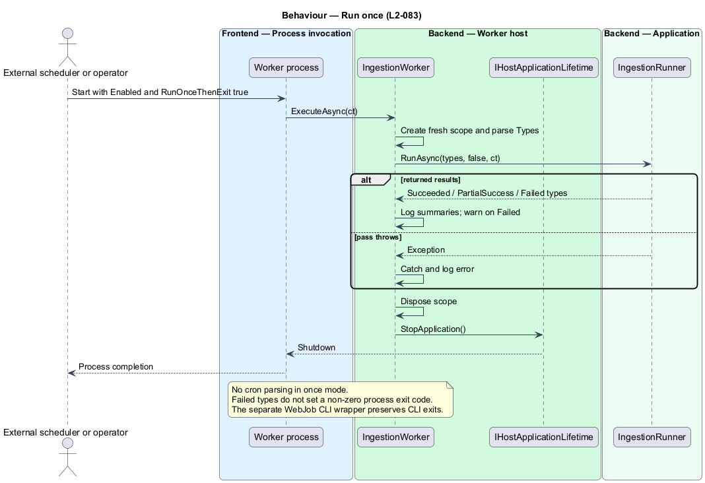

# Schedule catalog ingestion

## Overview

The standalone `Saturdaze.Worker` host refreshes discovery catalogs on a UTC schedule through the same `IngestionRunner` used by the CLI. A *scheduled pass* processes the configured catalog types sequentially inside a newly created dependency-injection scope.

The worker supports a long-lived cron loop and a one-pass process mode. A separate WebJob wrapper can invoke the CLI when its executable is packaged with the wrapper; the main Azure deployment workflow does not currently publish either host.

## Description

`Program` registers infrastructure, ingestion services, schedule options, and `IngestionWorker` as a hosted service. `IngestionScheduleOptions` binds under `Saturdaze:Ingestion:Schedule`: Enabled defaults true, Cron defaults `0 0 8 * * 5` (Friday 08:00 UTC), Types defaults all, and RunOnStartup and RunOnceThenExit default false.

A disabled worker returns from its background execution method without stopping the host. RunOnStartup or RunOnceThenExit triggers an immediate pass before cron parsing. RunOnceThenExit then calls `IHostApplicationLifetime.StopApplication()` and does not enter the schedule loop.

`CronSchedule` accepts five- or six-field expressions in UTC. The worker computes the next occurrence from the current UTC instant, waits in cancellation-aware chunks of at most one hour, and runs a pass. It calculates the next occurrence after the pass completes; there is no catch-up queue or overlap inside one worker instance. Invalid cron or an unresolvable next occurrence logs an error and stops the host.

Each pass parses Types, opens a fresh scope, resolves `IngestionRunner`, and awaits a non-dry run. Per-type statuses and usage are logged. A failed returned status or a caught pass exception does not terminate the recurring loop; the next scheduled occurrence attempts another pass. Shutdown cancellation ends waiting or execution.

`backend/deploy/webjobs/ingest/run.sh` invokes an installed `saturdaze` command, or a CLI DLL selected by `SATURDAZE_CLI_DLL`, with `ingest --type all`. It exits with an error when neither executable is available. `settings.job` supplies the external trigger schedule. The Worker Dockerfile and WebJob files are deployment artifacts in source, not evidence of a running Azure job.

There is no distributed lease across worker replicas, and run-once failures do not select a non-zero process exit code. A scheduler can therefore observe process completion despite failed catalog types. Cancellation can leave ingestion audit rows open. These limitations remain explicit pending implementation changes.

Source anchors are [worker host](/backend/src/Saturdaze.Worker), [cron parser](/backend/src/Saturdaze.Application/Scheduling/CronSchedule.cs), [WebJob wrapper](/backend/deploy/webjobs/ingest), and [current deployment workflow](/.github/workflows/deploy.yml).

## Requirements

The following L2 requirements refine the cited L1 capabilities. Delivery artifacts do not establish that a scheduler is provisioned.

| L2 ID | Refines (L1) | Requirement |
|-------|--------------|-------------|
| `L2-082` | `L1-031` | Saturdaze.Worker shall run the shared ingestion runner on a configurable five- or six-field UTC cron schedule. It shall default to all catalog types on Fridays at 08:00 UTC and create a dependency-injection scope for each pass. |
| `L2-083` | `L1-031` | When RunOnceThenExit is enabled and the worker is enabled, the worker shall perform one ingestion pass and request host shutdown. A triggered WebJob may invoke the CLI ingestion command as an alternative entry point. |
| `L2-080` | `L1-015`, `L1-031` | Each non-dry ingestion type shall open an IngestionRun record before its provider call and record its final status, timing, item counts, and provider usage on normal completion. The runner shall reject a new provider call once the configured per-type UTC daily run limit is reached. |

## Diagrams

### System context

The context view identifies the operator, Saturdaze, and the external service boundary.

### Containers

The container view separates executable hosts, shared application code, external services, and persistence.

### Components

The component view traces control and data ownership through the runtime slice.

### Class structure

The class view shows selected implementation members; cancellation parameters and unrelated members are omitted where indicated by the call labels.

### Behaviour — scheduled-ingestion

The sequence includes the successful path and controlled failure or disabled branches.

### Behaviour — run-once

This sequence isolates the secondary execution path and its failure boundary.

