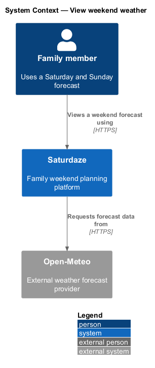
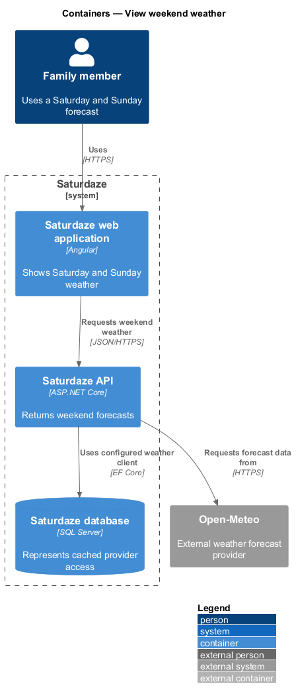
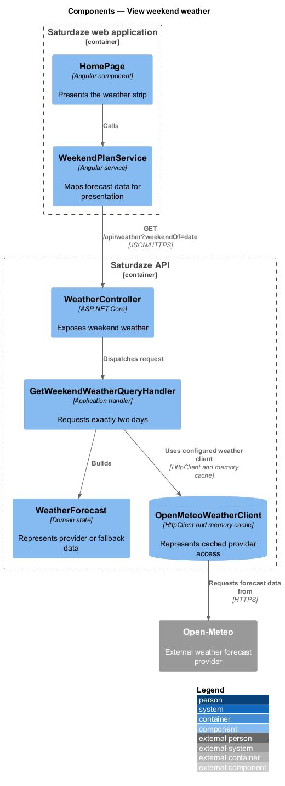
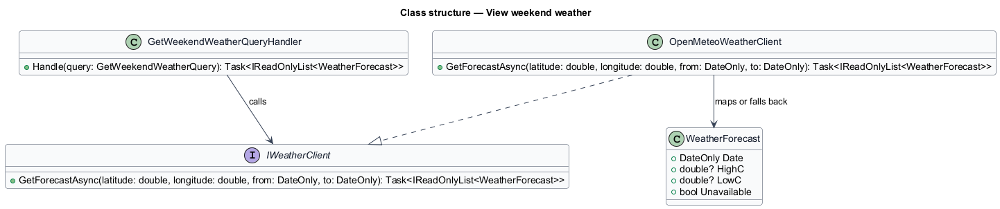
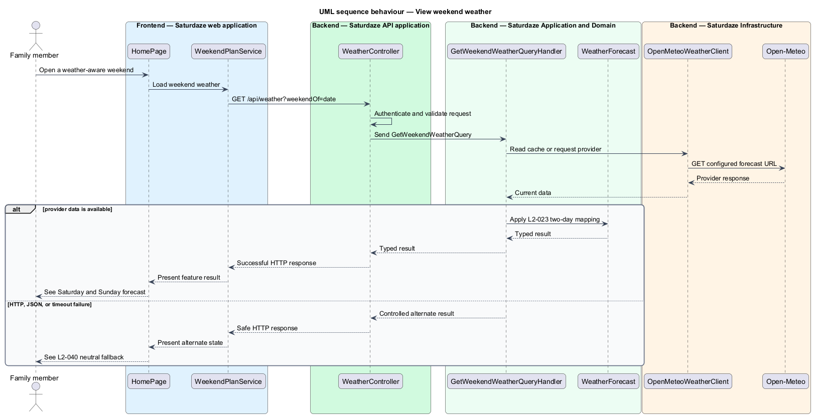

# View weekend weather

## Overview

Saturdaze is a web application that plans personalized family weekends. Weekend weather supplies two daily forecasts to planning and presentation while insulating users from upstream failures.

*neutral fallback* — two-day unavailable forecast returned when the weather provider cannot supply data

`GetWeekendWeatherQueryHandler` requests Saturday and Sunday from `IWeatherClient`. `OpenMeteoWeatherClient` caches successful results for 60 minutes and converts provider failures to neutral forecasts.

## Description

The feature forms a vertical slice across the Angular application, the ASP.NET Core API, application handlers, domain state, and SQL Server persistence.

- **`HomePage`** — Angular page that renders the weekend weather strip from weekend data.
- **`WeekendPlanService`** — Typed client service that maps weather DTOs into the overview.
- **`WeatherController`** — API controller exposing `GET /api/weather`.
- **`GetWeekendWeatherQueryHandler`** — Application handler that derives the two-day range.
- **`OpenMeteoWeatherClient`** — Infrastructure client using configured base URL, memory cache, resilience handling, and warning logs.
- **`WeatherForecast`** — Application record containing date, tags, temperatures, precipitation, and unavailable state.

`WeekendForecastService` reads the configured `HomeLocationOptions`; the family profile stores a free-text `HomeLocation` and geocoding it into coordinates is still an open gap. The production placeholder warning required by `L2-024` runs at startup (`WarnOnMissingProductionConfig` in `Program.cs`).
## Requirements

The feature realizes the following level-2 (L2) requirements. Each row cites the level-1 (L1) capability refined by the requirement.

| L2 ID | Refines (L1) | Requirement |
|-------|--------------|-------------|
| `L2-023` | `L1-009` | `GET /api/weather?weekendOf=<date>` must return exactly two forecast entries (Saturday and Sunday) for the family's home location, with each entry exposing day name, high temperature, low temperature, condition code, and a note string. |
| `L2-024` | `L1-009`, `L1-015` | The weather provider base URL must come from configuration (`Saturdaze:Weather:BaseUrl`), and on production startup the system must log a warning if any production-required configuration value is unset or still holds its placeholder. |
| `L2-040` | `L1-009`, `L1-015` | Upstream provider exceptions (HTTP, JSON, timeout) must be caught, logged at warning level, and substituted with a neutral fallback so the user never sees a 5xx caused by the upstream. |

## Diagrams

### System context

The context view identifies the person using the discovery capability and the systems that participate in the result.

### Containers

The container view follows the interaction from the Angular web application through the API to persistence and the external provider.

### Components

The component view names the page, client service, controller, handler, domain type, and infrastructure boundary involved in the slice.

### Class structure

The class view shows the request, handler, and state relationships used by the feature.

### Behaviour — load a two-day forecast with fallback

The sequence view traces the primary behaviour to `L2-023`, `L2-024`, and `L2-040`. Its alternate path produces a controlled empty, validation, authorization, or fallback state.

