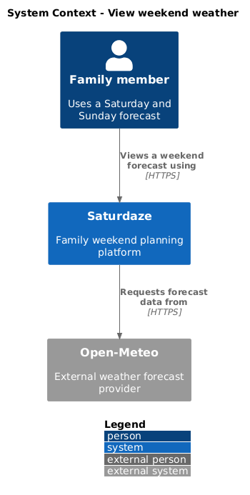
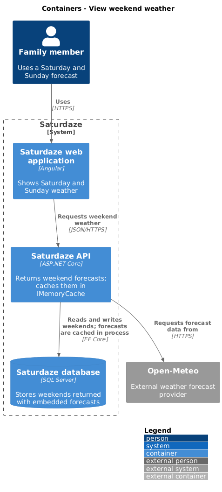
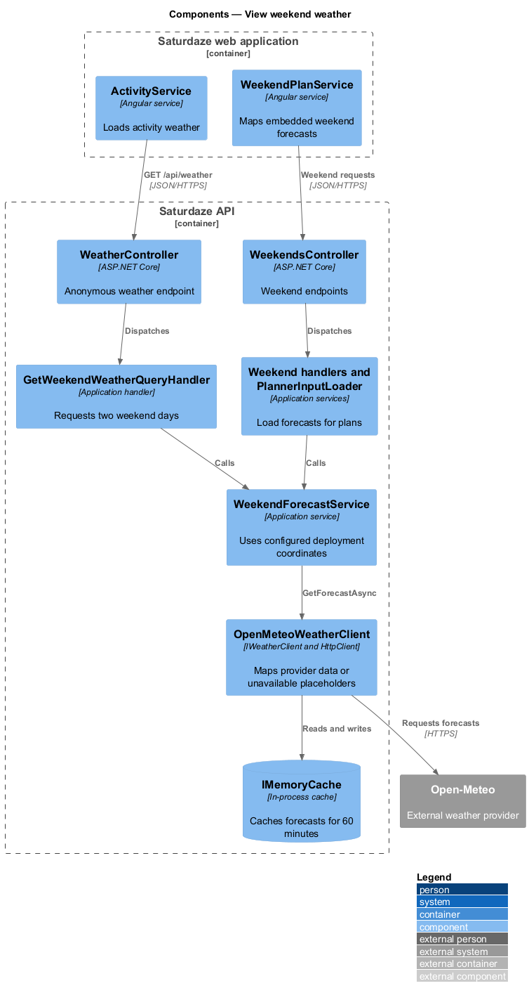
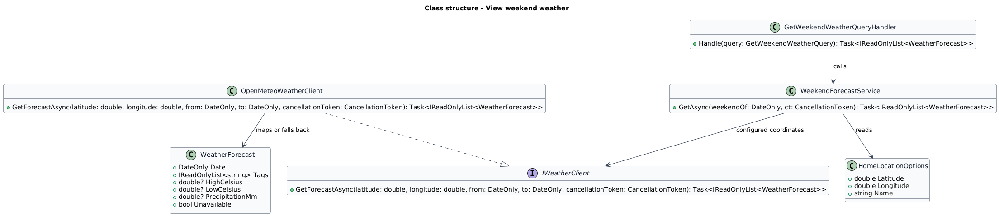
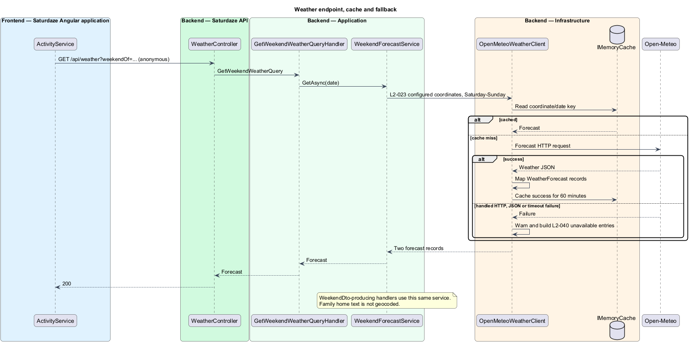

# View weekend weather

## Overview

Saturdaze is a web application that plans personalized family weekends. Weekend weather supplies two daily forecasts to planning and presentation while insulating users from upstream failures.

*neutral fallback* — two-day unavailable forecast returned when the weather provider cannot supply data

`GetWeekendWeatherQueryHandler` requests Saturday and Sunday from `IWeatherClient` through `WeekendForecastService`. `OpenMeteoWeatherClient` caches successful results for 60 minutes and converts provider failures to neutral forecasts.

## Description

`WeekendPage` displays forecast data from WeekendDto through `WeekendPlanService`. `ActivityService` separately requests the anonymous `GET /api/weather` endpoint for discovery grouping and treats a failed request as an empty forecast.

`WeatherController` dispatches `GetWeekendWeatherQuery`. `GetWeekendWeatherQueryHandler` delegates to `WeekendForecastService`, which calls `IWeatherClient` with configured HomeLocationOptions coordinates and the two-day range.

`OpenMeteoWeatherClient` reads its base URL from `Saturdaze:Weather:BaseUrl`, defaulting to `https://api.open-meteo.com/v1/`. It caches parsed responses in `IMemoryCache` for 60 minutes and returns unavailable entries on handled `HttpRequestException`, `TaskCanceledException`, and `JsonException` failures. WeatherForecast supplies dates, condition tags, temperatures, precipitation, and Unavailable; the browser derives labels and icons.

HomeLocation text stored on the family is not geocoded. Forecasts therefore use deployment coordinates rather than personalized coordinates. `WarnOnMissingProductionConfig` runs outside Development and warns when the JWT signing key is unset or a placeholder, or when CORS origins are empty. It does not check weather or home-location settings.

## Requirements

The following L2 requirements refine the cited L1 capabilities. Implementation gaps stated in Description do not waive these obligations.

| L2 ID | Refines (L1) | Requirement |
|-------|--------------|-------------|
| `L2-023` | `L1-009` | `GET /api/weather?weekendOf=<date>` shall return exactly two forecast entries (Saturday and Sunday) for the configured home location, with each entry exposing the date, the condition tags (`sunny`, `rain`, `snow`, `cold`, `cool`, `mild`, `warm`), high and low temperature, precipitation, and an `unavailable` flag; the client derives the day name, icon and note from those fields. |
| `L2-024` | `L1-009`, `L1-015` | The weather provider base URL shall come from configuration (`Saturdaze:Weather:BaseUrl`), and on production startup the system shall log a warning if any production-required configuration value is unset or still holds its placeholder. |
| `L2-040` | `L1-009`, `L1-015` | Upstream provider exceptions (HTTP, JSON, timeout) shall be caught, logged at warning level, and substituted with a neutral fallback so the user never sees a 5xx caused by the upstream. |

## Diagrams

### System context

The context view identifies the person using the discovery capability and the systems that participate in the result.

### Containers

The container view follows the interaction from the Angular web application through the API to persistence and the external provider.

### Components

The component view names the page, client service, controller, handler, domain type, and infrastructure boundary involved in the slice.

### Class structure

The class view shows the request, handler, and state relationships used by the feature.

### Behaviour — load a two-day forecast with fallback

The sequence view traces the primary behaviour to `L2-023`, `L2-024`, and `L2-040`. Its alternate paths cover a cache hit and the unavailable fallback; the endpoint is anonymous, so no authorization path applies.

