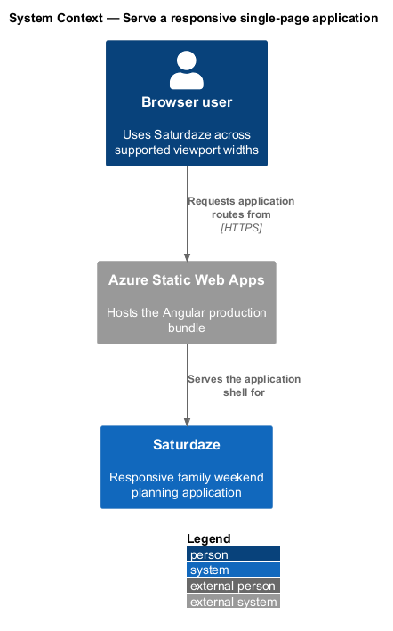
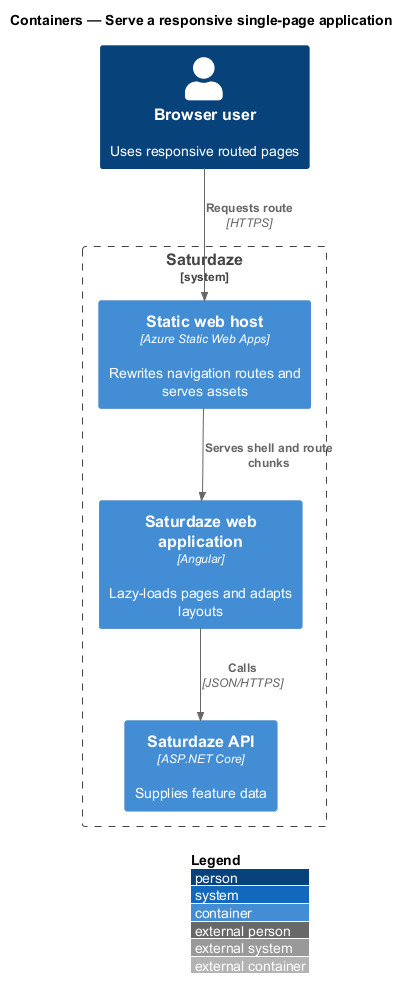
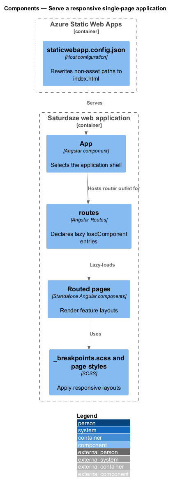
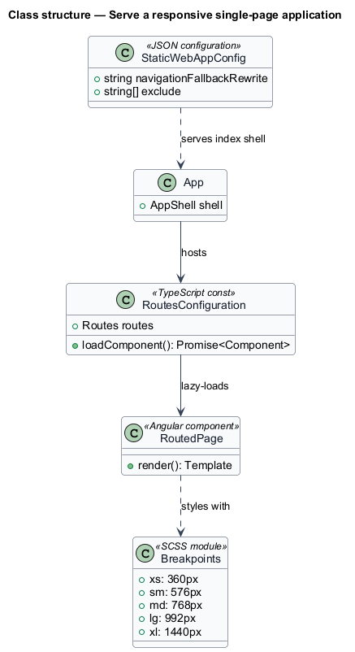
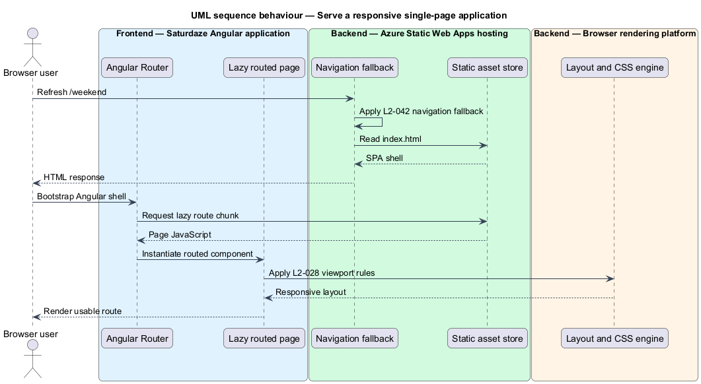

# Serve a responsive single-page application

## Overview

Saturdaze combines an Angular web application, an ASP.NET Core API, SQL Server persistence, and administrative delivery tooling. The responsive application loads routed pages on demand, adapts layouts at the defined viewport widths, and preserves client-side navigation on direct requests.

*navigation fallback* — Static Web Apps rewrite that returns `index.html` for a non-asset route

`app.routes.ts` uses `loadComponent` for every route. Component-library breakpoints and page styles adapt layouts, while `staticwebapp.config.json` rewrites deep links to the Angular shell.

## Description

The feature crosses the application and platform boundaries needed to deliver its observable outcome.

- **`routes`** — Angular route table whose entries load standalone page components dynamically.
- **`App`** — Angular application shell that selects splash, authentication, or product chrome.
- **`_breakpoints.scss`** — Shared component-library breakpoint definitions.
- **`Page SCSS files`** — Route-level responsive layouts for mobile, tablet, and desktop widths.
- **`staticwebapp.config.json`** — Static Web Apps configuration containing the navigation fallback and asset exclusions.
- **`Angular production build`** — Route-chunk output deployed by the web delivery job.

## Requirements

The feature realizes the following level-2 (L2) requirements. Each row cites the level-1 (L1) capability refined by the requirement.

| L2 ID | Refines (L1) | Requirement |
|-------|--------------|-------------|
| `L2-028` | `L1-011` | Every routed page (`/`, `/weekend`, `/itinerary`, `/activities`, `/restaurants`, `/events`, `/errand`, `/saved`, `/profile`, all auth pages) must render usably at viewport widths 360 px, 576 px, 768 px, 992 px, and 1440 px. |
| `L2-035` | `L1-013` | Every routed page (other than the splash) must be lazy-loaded via `loadComponent`, so the initial bundle excludes those pages' code. |
| `L2-042` | `L1-011`, `L1-016` | Refreshing any client-side route (e.g., `/login`, `/weekend`, `/itinerary`) on the Static Web App must return the SPA shell, not a 404. |

## Diagrams

### System context

The context view identifies the person using or operating the capability and the participating system boundary.

### Containers

The container view shows the deployable applications, platform services, or data stores that carry the feature.

### Components

The component view names the runtime or delivery components that implement the slice.

### Class structure

The class view shows the code and configuration relationships that control the feature.

### Behaviour — refresh a responsive lazy route

The sequence view traces the primary behaviour to `L2-028`, `L2-035`, and `L2-042`. Its alternate path shows the controlled non-success outcome.

