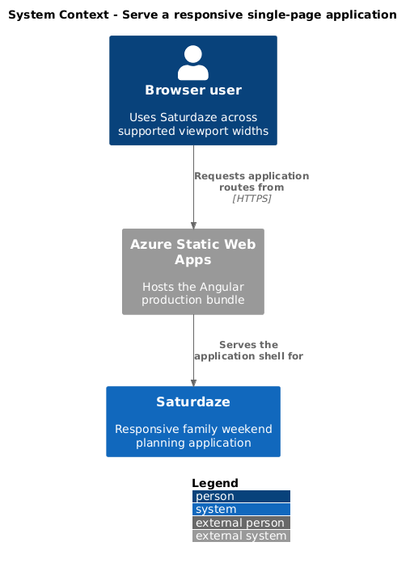
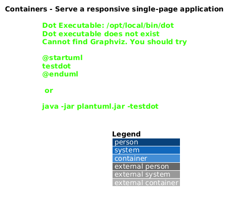
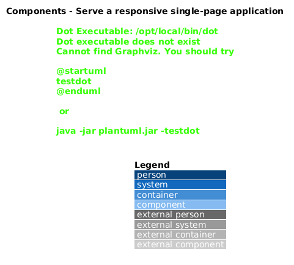
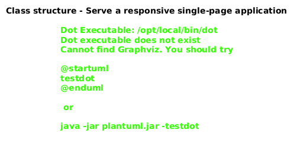
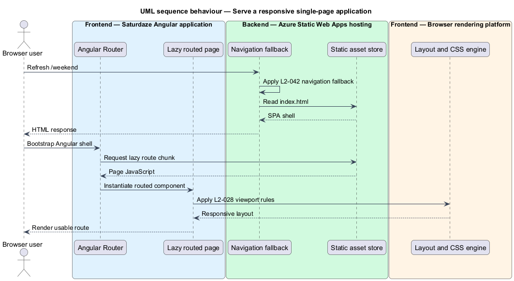

# Serve a responsive single-page application

## Overview

Saturdaze combines an Angular web application, an ASP.NET Core API, SQL Server persistence, and administrative delivery tooling. The responsive application loads routed pages on demand, adapts layouts at the defined viewport widths, and preserves client-side navigation on direct requests.

*navigation fallback* — Static Web Apps rewrite that returns `index.html` for a non-asset route

`app.routes.ts` uses `loadComponent` for rendered routes and redirect entries for retired paths. Component-library breakpoints and page styles adapt layouts, while `staticwebapp.config.json` rewrites deep links to the Angular shell.

## Description

`app.routes.ts` lazily loads rendered pages and defines legacy redirects. `App` merges route data along the active path and selects app, site, or bare chrome.

The app shell serves Weekend, Ideas, Past, Family, and Review submissions. Site chrome serves landing, legal, and shared-weekend pages; authentication uses bare chrome. `requireAnonymous`, `requireAuth`, and `requireAdmin` enforce route access.

Below 720 px, app routes use bottom navigation; from 720 px they use the top bar. The weekend's `.sd-grid-days` stacks days below 1024 px and sets two day columns from 1024 px. `_breakpoints.scss`, `_global.scss`, and component/page SCSS preserve the BEM class contract with `docs/mocks`.

Legacy paths such as `/login`, `/profile`, `/saved`, and `/itinerary` redirect to `/sign-in`, `/family`, `/past`, and `/weekend`. The `**` wildcard redirects any unmatched path to `/`. The `/dialogs` gallery route and the dev state overrides exist only when `environment.galleryRoutes` is enabled; the production environment disables it.

`staticwebapp.config.json` provides deep-route fallback. ADR-010 defines visual tiers, masks, and mock-derived baselines; rendering bounds remain 320 through 1920 px.

## Requirements

The following L2 requirements refine the cited L1 capabilities. Implementation gaps stated in Description do not waive these obligations.

| L2 ID | Refines (L1) | Requirement |
|-------|--------------|-------------|
| `L2-028` | `L1-011` | Every routed page (`/`, `/weekend`, `/ideas`, `/ideas/food`, `/ideas/events`, `/past`, `/family`, `/review-submissions`, `/legal`, `/sample-weekend`, all auth pages) shall render usably at viewport widths 320 px, 390 px, 820 px, 1440 px, and 1920 px. (Revised 2026-09-02 with the v2 design, [ADR-009](/docs/adr/ADR-009-v2-responsive-shell.md): the v1 split view is gone; the shell is a top bar from 720 px and a bottom nav below it.) |
| `L2-035` | `L1-013` | Every rendered route component, including the landing page, shall be lazy-loaded via `loadComponent`, so the initial bundle excludes those pages' code. |
| `L2-042` | `L1-011`, `L1-016` | Refreshing any client-side route (e.g., `/sign-in`, `/weekend`, `/ideas/events`) on the Static Web App shall return the SPA shell, not a 404. |

## Diagrams

### System context

The context view identifies the person using or operating the capability and the participating system boundary.

### Containers

The container view shows the deployable applications, platform services, or data stores that carry the feature.

### Components

The component view names the runtime or delivery components that implement the slice.

### Class structure

The class view shows selected code and configuration relationships. Cancellation parameters and unrelated members are omitted.

### Behaviour — refresh a responsive lazy route

The sequence view traces the primary behaviour to `L2-028`, `L2-035`, and `L2-042`. Its alternate path shows the controlled non-success outcome.

