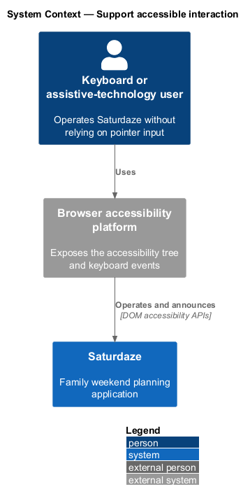
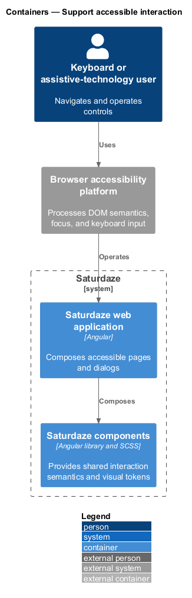
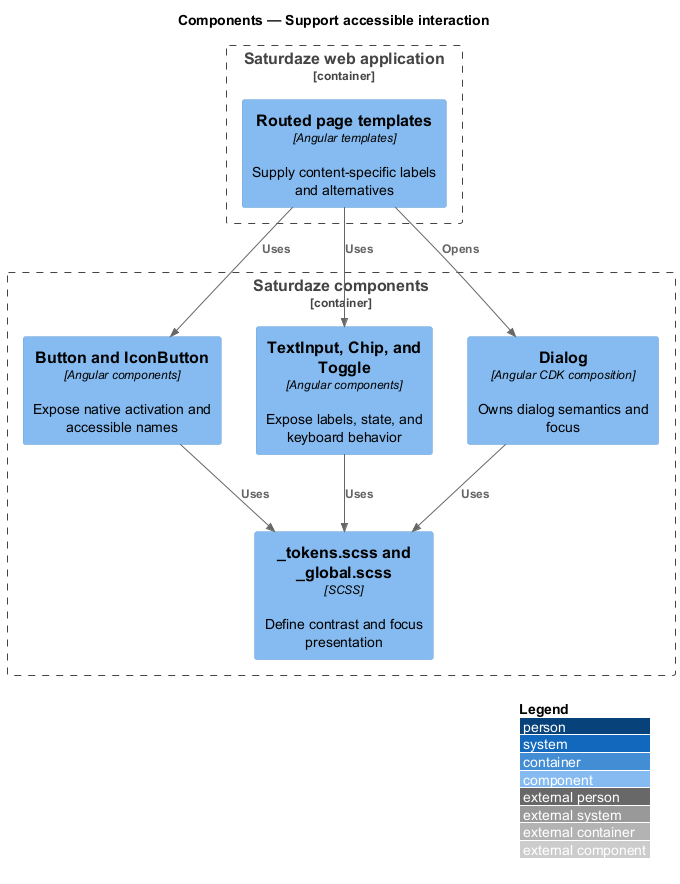
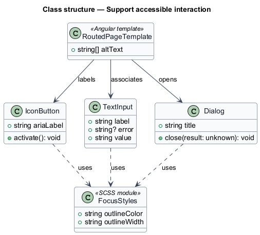
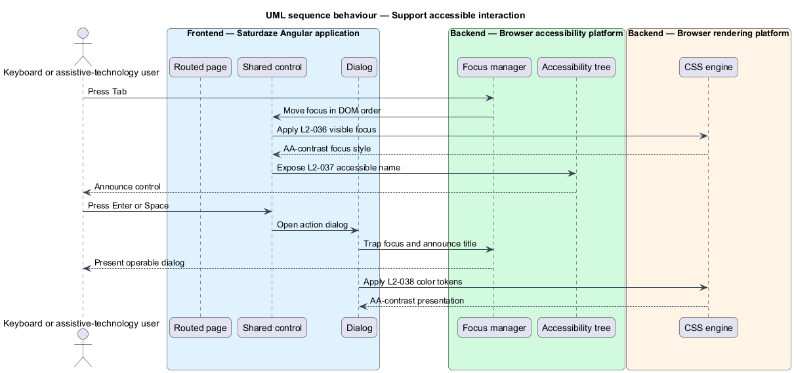

# Support accessible interaction

## Overview

Saturdaze combines an Angular web application, an ASP.NET Core API, SQL Server persistence, and administrative delivery tooling. The accessible interaction slice makes navigation, controls, dialogs, text, and meaningful imagery perceivable and operable without a pointing device.

*accessible name* — programmatic label exposed to assistive technology for a meaningful element

Shared components centralize keyboard behavior, labels, focus styles, and color tokens. Routed pages compose those controls and supply content-specific labels and alternative text.

## Description

The feature crosses the application and platform boundaries needed to deliver its observable outcome.

- **`Button and IconButton`** — Shared Angular controls with native button semantics and icon-only labelling.
- **`TextInput`** — Shared Angular form control that associates visible labels and validation text.
- **`Dialog`** — Shared dialog frame used with Angular CDK focus management.
- **`Chip and Toggle`** — Shared interactive controls with keyboard and state semantics.
- **`_tokens.scss and _global.scss`** — Shared color and focus styles used by component SCSS.
- **`Routed page templates`** — Feature templates that provide descriptive labels and image alternatives.

## Requirements

The feature realizes the following level-2 (L2) requirements. Each row cites the level-1 (L1) capability refined by the requirement.

| L2 ID | Refines (L1) | Requirement |
|-------|--------------|-------------|
| `L2-036` | `L1-014` | Every button, link, form control, and dialog action must be reachable via Tab order and operable with Enter/Space, and the visible focus indicator must meet WCAG 2.1 AA contrast. |
| `L2-037` | `L1-014` | Icon-only buttons must carry `aria-label`, form fields must have associated labels, and images carrying meaning must have descriptive `alt` text. |
| `L2-038` | `L1-014` | All text, including chip labels and disabled controls used to convey state, must meet a 4.5:1 contrast ratio against its background (3:1 for large text ≥18 pt or 14 pt bold). |

## Diagrams

### System context

The context view identifies the person using or operating the capability and the participating system boundary.

### Containers

The container view shows the deployable applications, platform services, or data stores that carry the feature.

### Components

The component view names the runtime or delivery components that implement the slice.

### Class structure

The class view shows the code and configuration relationships that control the feature.

### Behaviour — operate a labelled dialog by keyboard

The sequence view traces the primary behaviour to `L2-036`, `L2-037`, and `L2-038`. Its alternate path shows the controlled non-success outcome.

