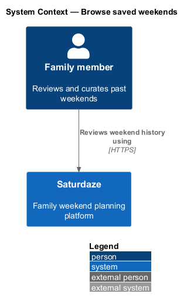
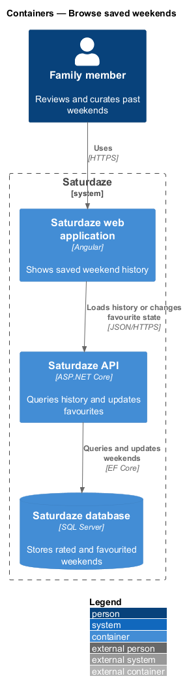
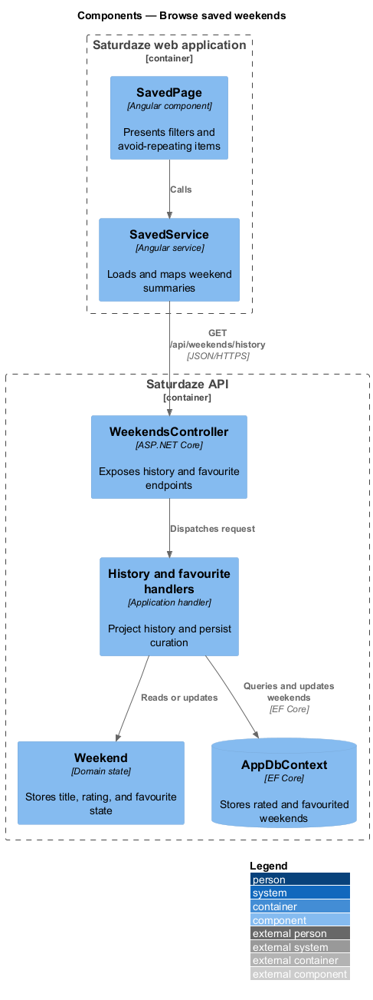
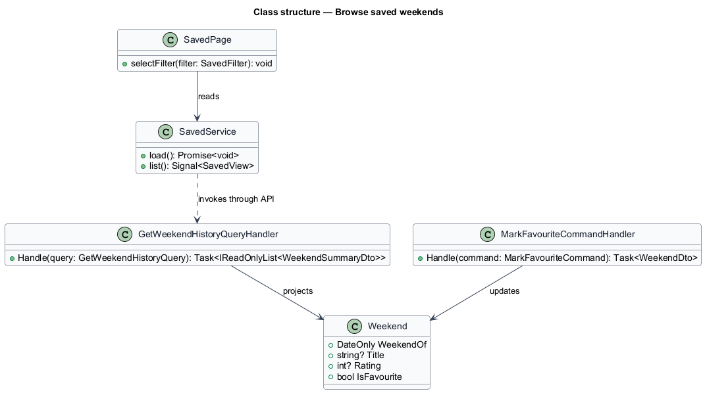
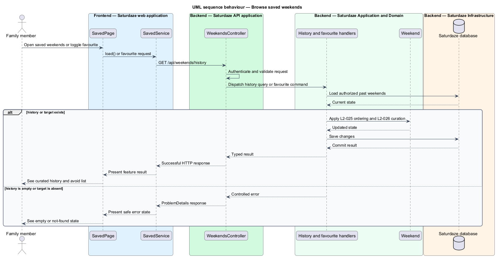

# Browse saved weekends

## Overview

Saturdaze is a web application that plans personalized family weekends. Saved-weekend history turns completed plans into reusable records with favourites, ratings, highlights, and avoid-repeating signals.

*avoid-repeating item* — activity from a weekend rated two stars or lower

`SavedPage` presents filtered history from `SavedService`. The API orders `Weekend` summaries by date and persists favourite state.

## Description

The feature forms a vertical slice across the Angular application, the ASP.NET Core API, application handlers, domain state, and SQL Server persistence.

- **`SavedPage`** — Angular page that presents history filters, highlights, and avoid-repeating items.
- **`SavedService`** — Typed client service that loads and maps weekend summaries.
- **`WeekendsController`** — API controller exposing history and favourite endpoints.
- **`GetWeekendHistoryQueryHandler`** — Application handler that orders and projects past weekends.
- **`MarkFavouriteCommandHandler`** — Application handler that persists favourite state.
- **`Weekend`** — Domain aggregate storing title, rating, favourite state, blocks, and errands.

`RateWeekendCommandHandler` (`PUT /api/weekends/{id}/rating`, `{ rating: 1..5 | null }`) persists or clears the rating and `RenameWeekendCommandHandler` (`PUT /api/weekends/{id}/title`) persists the user-supplied title; both are family-scoped and surface through `WeekendDto` and the history summary. The saved page exposes them through a CDK `RatingDialog` and the favourite heart.
## Requirements

The feature realizes the following level-2 (L2) requirements. Each row cites the level-1 (L1) capability refined by the requirement.

| L2 ID | Refines (L1) | Requirement |
|-------|--------------|-------------|
| `L2-025` | `L1-010` | `GET /api/weekends/history?take=N` must return up to N past weekends ordered by `WeekendOf` descending and include each weekend's title, rating, favourite flag, and a short highlights summary. |
| `L2-026` | `L1-010` | `PUT /api/weekends/{id}/favourite` must set `IsFavourite` to the request value, and the system must persist a 1–5 star rating on every weekend. |
| `L2-027` | `L1-010` | The `/saved` page must list activities that appeared in a past weekend rated ≤2 stars under an "Avoid repeating" section, with a "Skip" chip. |

## Diagrams

### System context

The context view identifies the family member using the capability and the Saturdaze system that owns the weekend state.

### Containers

The container view follows the interaction from the Angular web application through the API to SQL Server.

### Components

The component view names the page, client service, controller, handler, domain type, and persistence boundary involved in the slice.

### Class structure

The class view shows the request path and the state relationships used by the feature.

### Behaviour — load and curate weekend history

The sequence view traces the primary behaviour to `L2-025`, `L2-026`, and `L2-027`. Its alternate path preserves valid existing state when the request cannot proceed.

