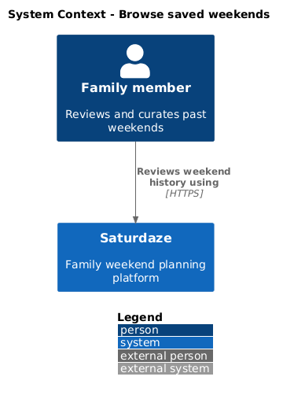
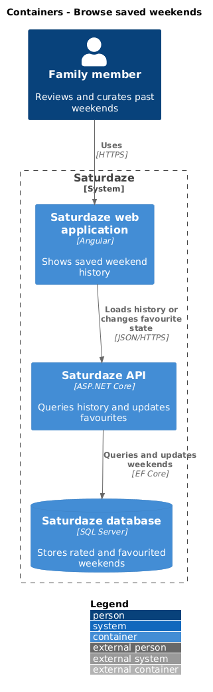
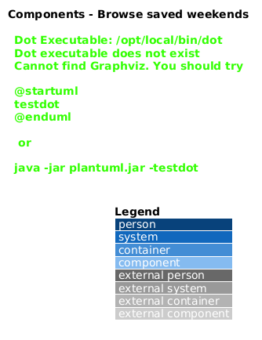
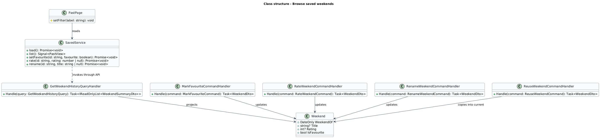
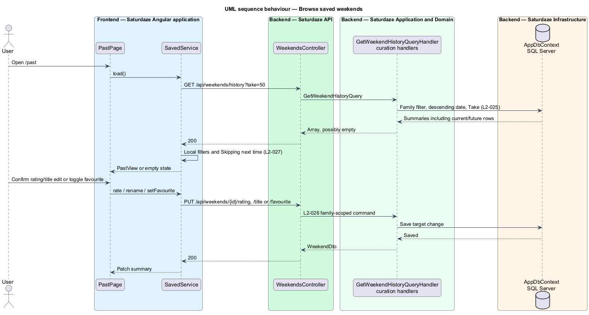
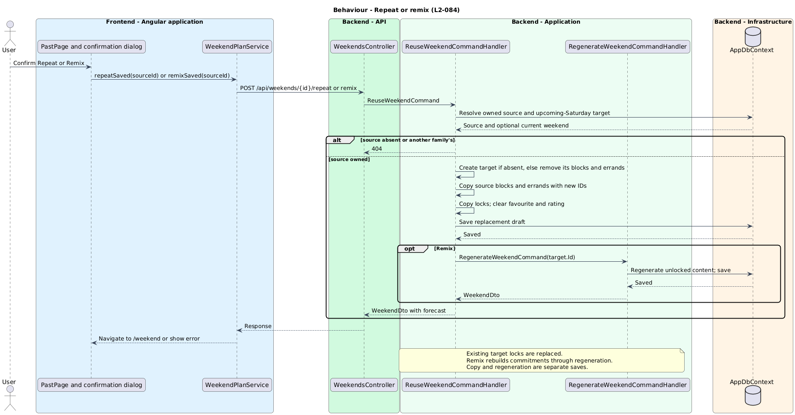

# Browse saved weekends

## Overview

Saturdaze is a web application that plans personalized family weekends. Saved-weekend history turns completed plans into reusable records with favourites, ratings, highlights, and avoid-repeating signals.

*avoid-repeating item* — activity from a weekend rated two stars or lower

`PastPage` presents filtered history from `SavedService`. The API orders `Weekend` summaries by date and persists favourite state.

## Description

`PastPage` at `/past` reads `SavedService.list(): Signal<PastView>` through `SAVED_SERVICE`. The service requests up to 50 summaries and filters favourites, year, and five-star ratings locally.

`GetWeekendHistoryQueryHandler` filters by family, orders by WeekendOf descending, and projects title, rating, favourite state, and activity highlights. `GetWeekendHistoryQueryValidator` accepts a take from 1 to 100; other values return 400. The query has no cursor or offset, and it currently includes the current and future weekends.

`RatingDialog` and `RenameWeekendDialog` collect edits; favourite actions send the selected boolean. `RateWeekendCommandHandler`, `RenameWeekendCommandHandler`, and `MarkFavouriteCommandHandler` persist them after ownership checks.

`PastPage` confirms Repeat and Remix before calling `WeekendPlanService.repeatSaved()` or `remixSaved()` and navigating to `/weekend`. `ReuseWeekendCommandHandler` replaces the current draft, or creates one for the upcoming Saturday, with copied source blocks and errands using new IDs. Repeat copies source locks; Remix subsequently regenerates unlocked content.

`skippingChips()` derives the Skipping next time strip from low-rated highlights. Planner history does not carry ratings, so that display does not enforce future exclusion. Repeat also replaces existing target locks, despite stronger confirmation-copy claims.

Past cards lead with the weekend's cover photo since the 2026-10-06 mock (`docs/mocks/pages/past.html`). `weekend-planning/choose-weekend-cover-photo` designs `WeekendSummaryDto.Cover`, the cover label, and the "Add a photo" control (L2-098). The current `PastPage` renders text-only cards until that design is implemented.

## Requirements

The following L2 requirements refine the cited L1 capabilities. Implementation gaps stated in Description do not waive these obligations.

| L2 ID | Refines (L1) | Requirement |
|-------|--------------|-------------|
| `L2-025` | `L1-010` | `GET /api/weekends/history?take=N` shall return up to N past weekends ordered by `WeekendOf` descending and include each weekend's title, rating, favourite flag, and a short highlights summary. |
| `L2-026` | `L1-010` | `PUT /api/weekends/{id}/favourite` shall set `IsFavourite` to the request value; `PUT /api/weekends/{id}/rating` (`{ rating: 1..5 \| null }`) shall persist or clear a 1–5 star rating; `PUT /api/weekends/{id}/title` shall persist the user-supplied title. |
| `L2-027` | `L1-010` | The `/past` page shall list activities that appeared in a past weekend rated ≤2 stars under an "Skipping next time" section, with a "Skip" chip. |
| `L2-084` | `L1-010` | The family-scoped repeat and remix endpoints shall copy a source weekend into the current weekend, replacing its draft blocks and errands. Repeat shall retain the copied plan; remix shall regenerate its unlocked portion. |

## Diagrams

### System context

The context view identifies the family member using the capability and the Saturdaze system that owns the weekend state.

### Containers

The container view follows the interaction from the Angular web application through the API to SQL Server.

### Components

The component view names the page, client service, controller, handler, domain type, and persistence boundary involved in the slice.

### Class structure

The class view shows the request path and the state relationships used by the feature.

### Behaviour — load and curate weekend history

The sequence view traces the primary behaviour to `L2-025`, `L2-026`, and `L2-027`. Its alternate path preserves valid existing state when the request cannot proceed.

### Behaviour — reuse a saved weekend

This sequence records the current implementation, including its failure boundary.

