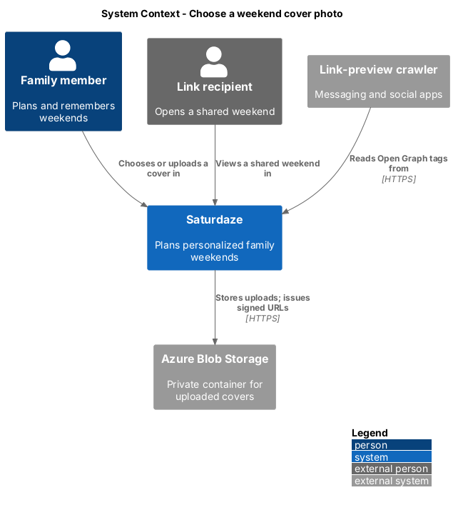
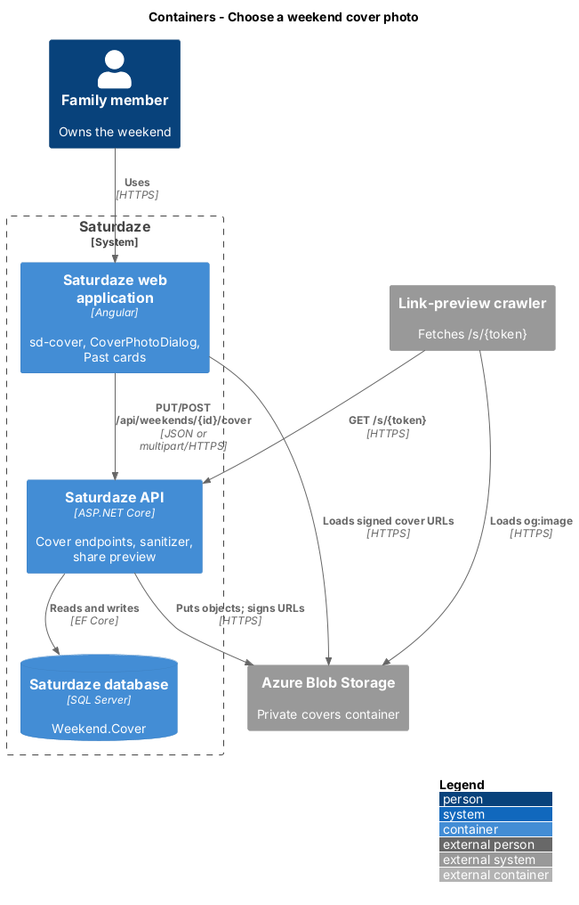
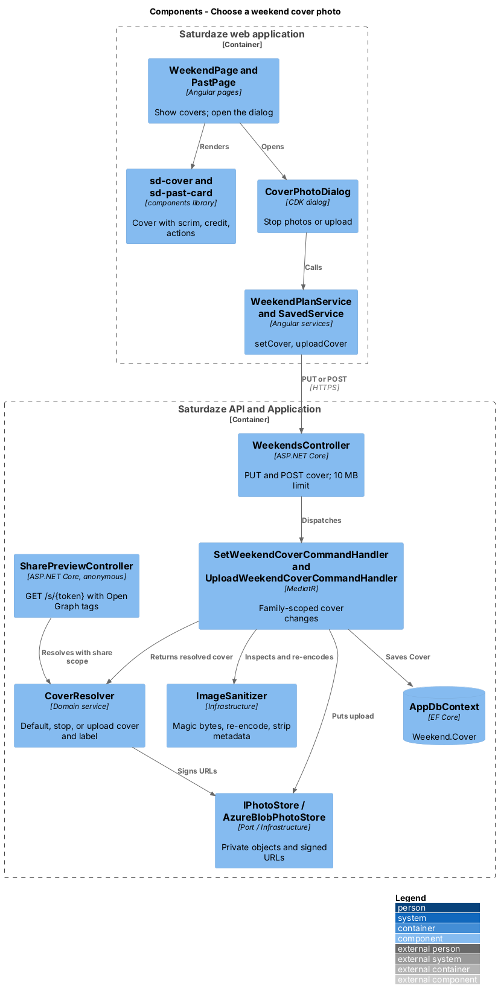
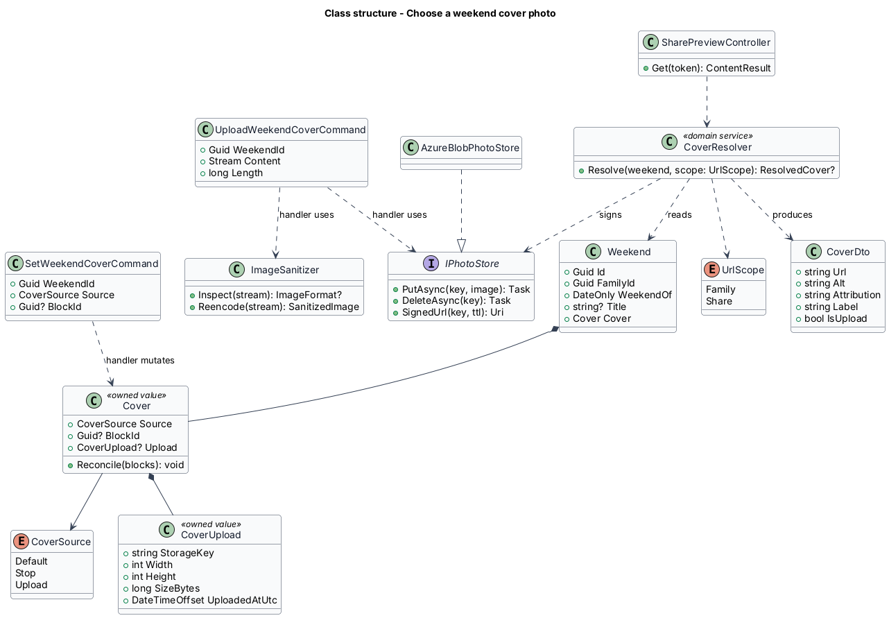
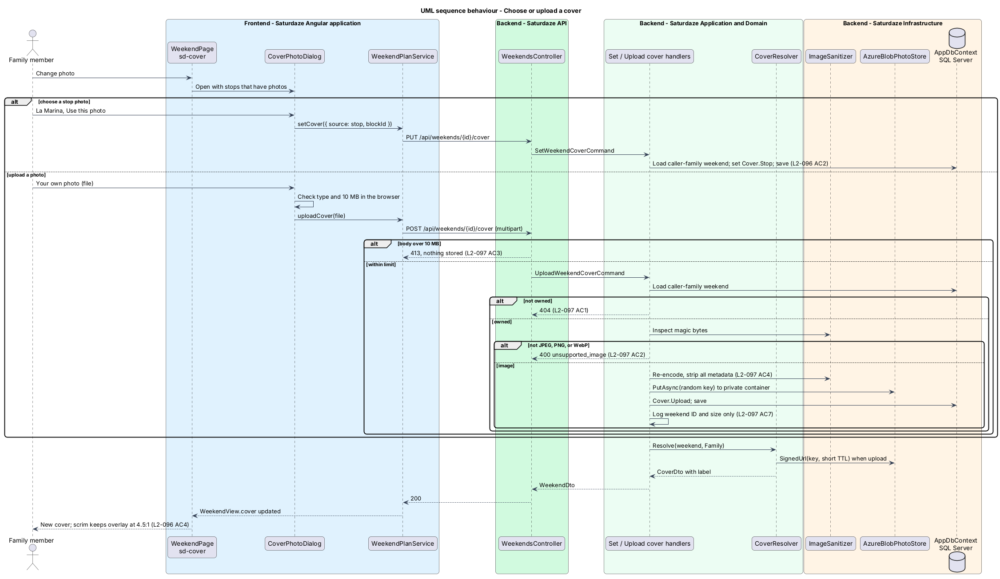
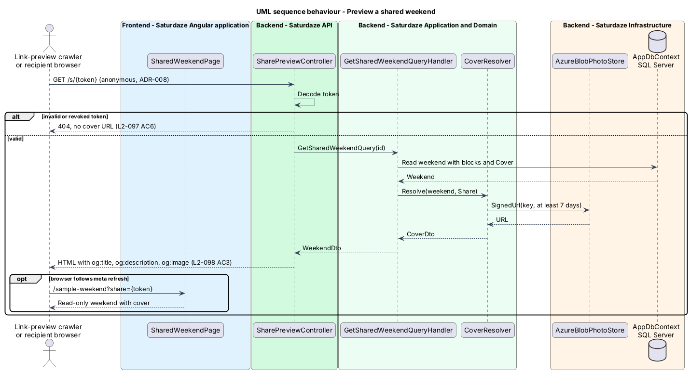

# Choose a weekend cover photo

## Overview

Saturdaze is a web application that plans personalized family weekends. Each weekend now opens on a cover: a photo with the date range, the title, and the summary laid over it (`docs/mocks/pages/weekend.html`). The same cover identifies the weekend on the Past screen (`docs/mocks/pages/past.html`) and is the preview image when a family shares the weekend link.

*cover* — photo that represents one weekend on the Weekend screen, in Past, and in link previews

*default cover* — primary photo of Saturday's day highlight, else Sunday's, else the photo fallback

*stop cover* — cover the family picked from the photos of the weekend's stops

*uploaded cover* — photo a family member uploaded for the weekend, private to the family and to holders of its share link

*day highlight* — the block the planner marks as the day's main activity (the "Day highlight" chip)

*signed URL* — time-limited URL that grants read access to one private object

This feature adds the cover to the `Weekend` aggregate, the "Change photo" dialog (D29 in `docs/mocks/pages/dialogs.html`), a safe upload path, cover photos on Past cards, and Open Graph tags for shared links. Place photos come from `discovery/store-place-location-and-imagery`; the rest of the Weekend screen is `weekend-planning/map-itinerary-and-travel-legs`.

## Description

### Domain

`Weekend` gains `CoverSource` (`Default`, `Stop`, `Upload`) and, for a chosen stop, `CoverPlaceKind` and `CoverPlaceId`, the place rather than the block, so the choice survives regeneration while that place is still planned. Upload fields arrive with L2-109. A new weekend starts with `CoverSource = Default`.

`WeekendEnrichment` resolves the cover into a `CoverDto(Url, Width, Height, Alt, Attribution, Label, Source, PlaceId)` or `null`. `WeekendEnrichmentBehavior`, a MediatR pipeline behaviour, runs it on every response that is a `WeekendDto`, so the many weekend handlers keep sharing the static `WeekendMapper`; it also adds each stop's place photo to its block (`ItineraryBlockDto.Photo`) for thumbnails and the picker:

- `Default` uses the photo of Saturday's highlight (its first activity), else Sunday's (L2-108 AC1).
- `Stop` uses the chosen place's photo while a block still points at that place; otherwise the default rule applies, which is how a regenerated weekend reverts (AC6).
- `Upload` uses a signed URL for `StorageKey`.

The label is "Your photo" for an upload and "From {place}" otherwise (L2-110 AC1). With no photo, the result is `null` and clients show the fallback; the title still renders as the page `h1` (L2-108 AC3).

Because the fallback happens when the cover is resolved, no replanning handler needs to reconcile it. An `Upload` cover survives regeneration.

### API

`WeekendDto` and `WeekendSummaryDto` gain `Cover: CoverDto?` (`Url`, `Width`, `Height`, `Alt`, `Attribution`, `Label`, `Source`, `PlaceId`). `GetWeekendHistoryQueryHandler` projects each weekend's activity and meal stops and asks `WeekendEnrichment.CoverAsync` for the same cover the Weekend screen resolves.

`PUT /api/weekends/{id}/cover` takes `{ source: "default" }` or `{ source: "stop", placeId }` and dispatches `SetWeekendCoverCommand`. A `placeId` that is not a stop of this weekend with a photo returns 400 `cover_not_a_stop`. The choice persists (L2-108 AC2).

`POST /api/weekends/{id}/cover` takes `multipart/form-data` with one `file` part and dispatches `UploadWeekendCoverCommand` (L2-109):

1. `ICurrentFamilyAccessor` scopes the weekend; another family's ID returns 404 (AC1).
2. The endpoint refuses a `Content-Length` or `file` part over 10 MB (`PhotoOptions.MaxUploadBytes`) with 413 before anything is decoded or stored; `[RequestSizeLimit]` also lets Kestrel refuse larger bodies (AC3).
3. `IImageSanitizer` (`SkiaImageSanitizer`, SkiaSharp) reads the magic bytes and accepts only JPEG, PNG, or WebP whatever the file name says; anything else returns 400 `unsupported_image` (AC2).
4. It decodes, applies the EXIF orientation, caps the long edge at 2400 px, and re-encodes to JPEG at quality 85. Re-encoding writes pixels only, so every metadata profile, including EXIF GPS, is gone (AC4).
5. `IPhotoStore.PutAsync` writes the result under a random key (`{32 hex}.jpg`, never the file name), and the handler sets `CoverSource = Upload` with `CoverUploadKey`, `CoverUploadWidth`, and `CoverUploadHeight`. A replaced upload is deleted, including when the family switches back to a stop or the default.
6. The handler logs the weekend ID and byte size only, never the file name or content (AC7).

`IPhotoStore`, `IPhotoUrlSigner`, and `IImageSanitizer` are application ports. `FileSystemPhotoStore` keeps photos in a private directory (`Saturdaze:Photos:Directory`) that is never served statically. `HmacPhotoUrlSigner` signs `/api/photos/{key}?exp={unix}&sig={HMAC-SHA256(key|exp)}` with `Saturdaze:Photos:SigningKey` (at least 32 bytes, set per environment like the JWT key). The anonymous `PhotosController` serves a photo only for a valid, unexpired signature and returns 403 otherwise (AC5); the signature is the credential, which is what lets a share-link holder and a link-preview crawler read it. Family URLs live 15 minutes (`FamilyUrlMinutes`) and are re-signed on every weekend read; share URLs live 7 days (`ShareUrlDays`). The URL is API-relative, so the app anchors it to `API_BASE_URL`, and the API origin joins the CSP `img-src`. Moving the store to private Azure Blob Storage with user-delegation SAS URLs is `<TO SUPPLY>` and replaces only the two Infrastructure classes.

`GetSharedWeekendQueryHandler` resolves the cover with a share-scoped signed URL only when the token is valid; a revoked or invalid token returns 404 and no URL (AC6). Token revocation does not exist today; adding it is `<TO SUPPLY>`.

### Link previews

Link-preview crawlers do not run the Angular application, so the static host cannot emit per-weekend tags. `WeekendsController.SharePreview` adds an anonymous `GET /s/{token}` route on the API (opted out of the fallback policy, ADR-008). It returns a small HTML document with `og:title` (the weekend title), `og:description` (the summary), `og:image` (a share-scoped signed URL valid for at least 7 days), and `twitter:card`, then redirects browsers to `{Saturdaze:Share:AppOrigin}/sample-weekend?share={token}` with a `<meta http-equiv="refresh">` and a link (L2-110 AC3). An API-relative upload URL is made absolute with the API's own origin. `WeekendsController.Share` returns this `/s/{token}` URL as `shareUrl`, built from the request's scheme and host. The public host name for `/s/`, and forwarded-header handling behind the App Service front end, are `<TO SUPPLY>`; `Saturdaze:Share:AppOrigin` must be set per environment.

### Frontend

`sd-cover` is a new `components` component for `.cover`: an `` sized like `sd-media`, eager-loaded because it is above the fold, the credit chip, the eyebrow, the `h1` title, the summary, a gradient scrim that keeps the overlay at 4.5:1 over light and dark regions (L2-108 AC4), and a projected action slot for "Change photo". Its aspect ratio is 16:9 below 720 px and 21:8 from 720 px; the Add to calendar, Share, and More actions sit below it (L2-108 AC5). A null cover renders the tinted fallback.

`CoverPhotoDialog` is a new CDK dialog in `frontend/projects/saturdaze/src/app/dialogs/cover-photo-dialog`. It lists the weekend's stops that have photos as a radio group of `photo-pick__opt` tiles, plus a "Your own photo" file input that accepts `image/jpeg,image/png,image/webp`. It checks type and the 10 MB limit before upload, previews the chosen file in the tile, uploads it itself through `IWeekendPlanService.uploadCover` when "Use this photo" is pressed, and keeps the dialog open with the server's refusal (413, `unsupported_image`) in an `sd-banner`. A stop choice is returned to the page, which calls `setCover`.

`IWeekendPlanService` gains `setCover(selection)` and `uploadCover(file)` for the current weekend. `WeekendView` gains `cover: CoverView | null` and `dateRange`. `ISavedService` gains `coverChoices(weekendId)`, `uploadCover(weekendId, file)` and `setCover(weekendId, selection)`, and `PastWeekendCard` gains `cover: CoverView | null`. `CoverPhotoDialogData` carries an `upload(file)` callback, so the same dialog serves the Weekend cover and a Past card.

`sd-past-card` gains a `cover` input and an `addPhoto` output; it leads with `sd-media` and the cover label as its credit. A past weekend without a cover renders an "Add a photo" button in the media slot, named "Add a photo to {title}", which opens `CoverPhotoDialog` with that weekend's stop photos (L2-110 AC2). The Past grid keeps 1, 2, and 3 columns at 390, 820, and 1440 px with 16:9 covers (L2-110 AC4).

`SharedWeekendPage` shows the cover read-only.

## Requirements

The following L2 requirements refine the cited L1 capabilities.

| L2 ID | Refines (L1) | Requirement |
|-------|--------------|-------------|
| `L2-108` | `L1-034` | The Weekend screen shall open with a cover (`.cover`) showing the weekend's cover photo with the date range, the title, and the summary overlaid. The cover defaults to the primary photo of Saturday's day highlight, else Sunday's, else a tinted fallback. "Change photo" opens a CDK dialog (D29) offering every stop's photo plus "Your own photo". |
| `L2-109` | `L1-034`, `L1-012` | `POST /api/weekends/{id}/cover` shall accept a JPEG, PNG, or WebP up to 10 MB from a member of the owning family, store it in private object storage, and set it as the cover. The server shall verify the file by content (magic bytes), re-encode it, strip all metadata including EXIF location, and serve it only through short-lived signed URLs to the family or to a valid share-link holder. |
| `L2-110` | `L1-034`, `L1-010` | Past weekend cards shall lead with the weekend's cover (`docs/mocks/pages/past.html`), labelled "Your photo" for family uploads and "From {place}" otherwise. A past weekend without a cover shall show an "Add a photo" tile that opens D29. The shared-weekend page shall emit Open Graph `og:image`, `og:title`, and `og:description` so link previews show the cover. |

## Diagrams

### System context

The context view adds the link recipient and the link-preview crawler, which read the cover through a share token, and the object storage that holds uploads.

### Containers

The container view shows uploads flowing through the API into private Blob Storage, and signed URLs flowing back to the browser and to crawlers.

### Components

The component view names the dialog, cover component, endpoints, handlers, resolver, sanitizer, photo store, and share preview controller.

### Class structure

The class view shows the `Cover` value on `Weekend`, the resolver that turns it into a `CoverDto`, and the upload ports.

### Behaviour — choose or upload a cover

The sequence covers picking a stop photo and uploading a family photo, including the 404, 413, and `unsupported_image` alternates (`L2-108`, `L2-109`).

### Behaviour — preview a shared weekend

A crawler fetches `/s/{token}` and receives Open Graph tags with a share-scoped image URL; a browser is redirected to the shared page (`L2-110`).

