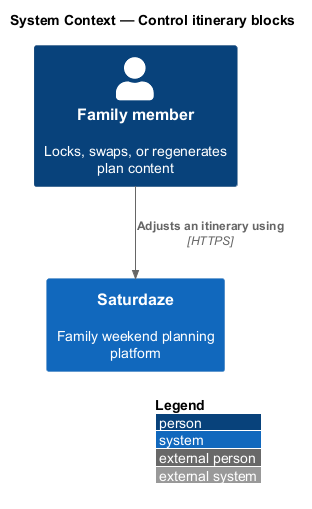
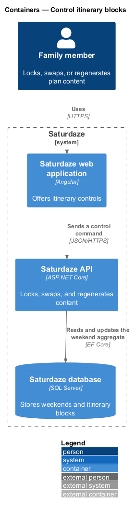
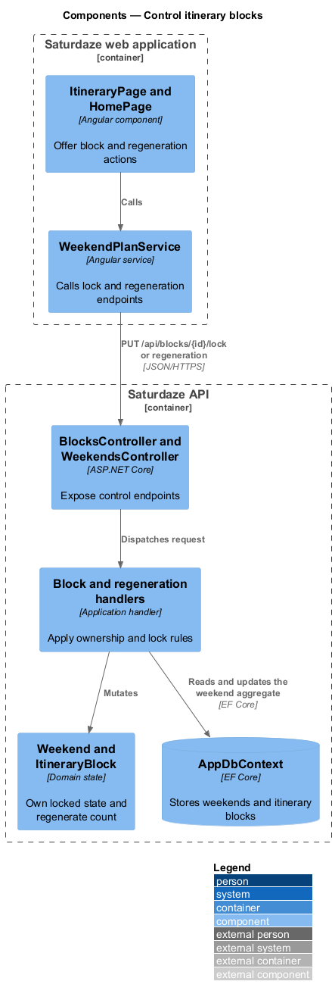
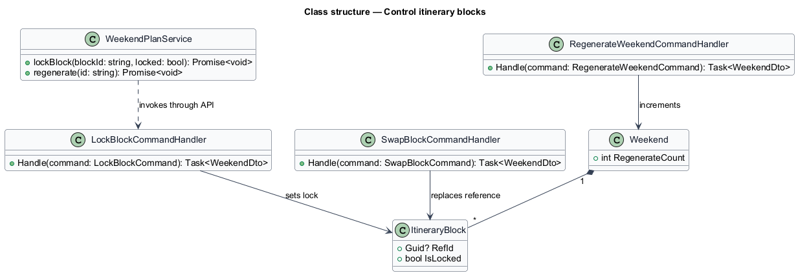
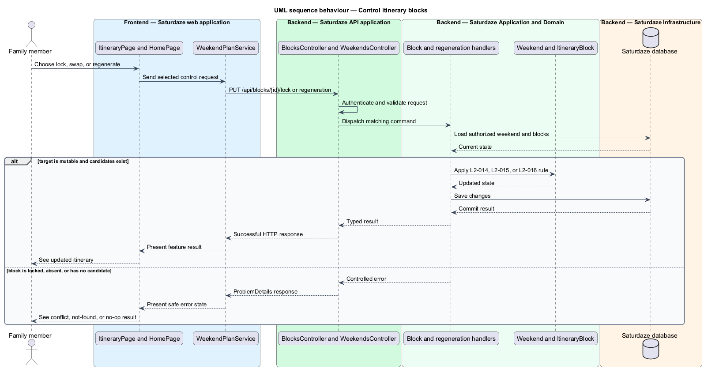

# Control itinerary blocks

## Overview

Saturdaze is a web application that plans personalized family weekends. Block control lets a family protect chosen plans and replace flexible suggestions without displacing protected content.

*locked block* — itinerary block excluded from swap and regeneration changes

The slice combines block-level lock and swap endpoints with weekend regeneration. Handlers authorize ownership before mutating the `Weekend` aggregate.

## Description

The feature forms a vertical slice across the Angular application, the ASP.NET Core API, application handlers, domain state, and SQL Server persistence.

- **`ItineraryPage and HomePage`** — Angular pages that expose lock, swap (through the timeline `BlockActionDialog`), and regenerate actions.
- **`WeekendPlanService`** — Typed client service that locks blocks and regenerates plans.
- **`BlocksController`** — API controller exposing block lock and swap endpoints.
- **`WeekendsController`** — API controller exposing weekend regeneration.
- **`LockBlockCommandHandler and SwapBlockCommandHandler`** — Family-scoped application handlers for block-level changes; a swap with no alternative is a 200 no-op that annotates the block's reason, a locked block is 409 `block_locked`.
- **`RegenerateWeekendCommandHandler`** — Application handler that retains locked blocks and increments the aggregate counter.

## Requirements

The feature realizes the following level-2 (L2) requirements. Each row cites the level-1 (L1) capability refined by the requirement.

| L2 ID | Refines (L1) | Requirement |
|-------|--------------|-------------|
| `L2-014` | `L1-004` | `PUT /api/blocks/{id}/lock` must set `ItineraryBlock.IsLocked` to the request value and return the parent weekend. |
| `L2-015` | `L1-004` | `POST /api/blocks/{id}/swap` must replace the activity referenced by a block with the next-best candidate, optionally excluding a list of rejected activity IDs supplied by the client. |
| `L2-016` | `L1-004` | `POST /api/weekends/{id}/regenerate` must rebuild every unlocked block, leave every locked block in place, and increment `Weekend.RegenerateCount`. |

## Diagrams

### System context

The context view identifies the family member using the capability and the Saturdaze system that owns the weekend state.

### Containers

The container view follows the interaction from the Angular web application through the API to SQL Server.

### Components

The component view names the page, client service, controller, handler, domain type, and persistence boundary involved in the slice.

### Class structure

The class view shows the request path and the state relationships used by the feature.

### Behaviour — change flexible itinerary content

The sequence view traces the primary behaviour to `L2-014`, `L2-015`, and `L2-016`. Its alternate path preserves valid existing state when the request cannot proceed.

