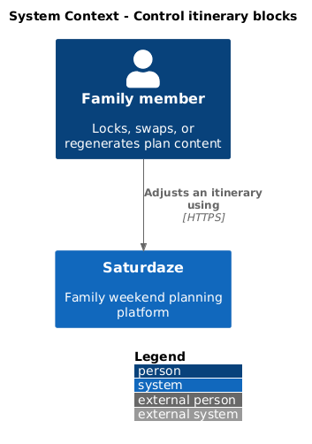
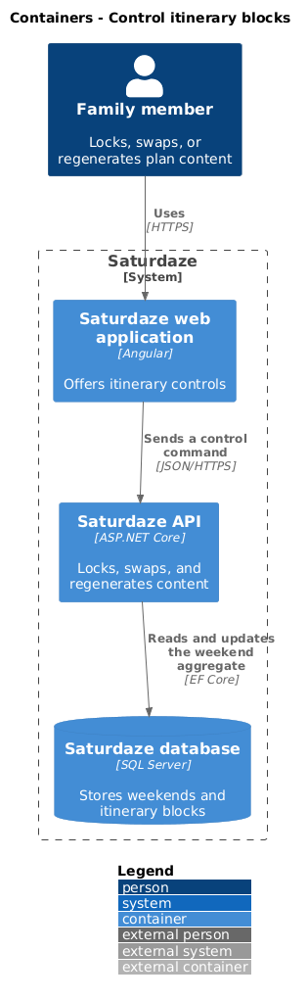
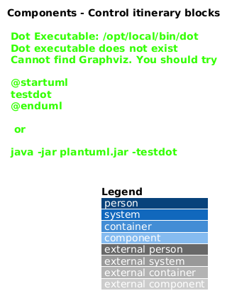
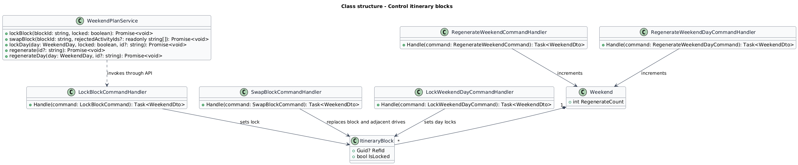
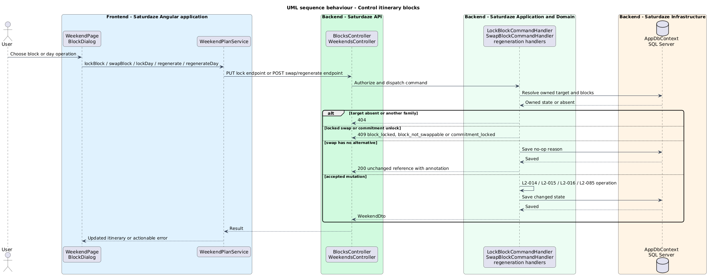

# Control itinerary blocks

## Overview

Saturdaze is a web application that plans personalized family weekends. Block control lets a family protect chosen plans and replace flexible suggestions without displacing protected content.

*locked block* — itinerary block excluded from swap and regeneration changes

The slice combines block-level lock and swap endpoints with weekend regeneration. Handlers authorize ownership before mutating the `Weekend` aggregate.

## Description

`WeekendPage` and `BlockDialog` expose locking, server-selected swaps, and regeneration through `WeekendPlanService`. The API returns the refreshed parent WeekendDto after changes.

`LockBlockCommandHandler` sets lock state after checking family ownership. Commitments cannot be unlocked. `SwapBlockCommandHandler` selects another fitting activity and honors supplied rejected IDs; locked blocks return 409 and no alternatives yield an annotated 200 no-op.

`RegenerateWeekendCommandHandler` and `RegenerateWeekendDayCommandHandler` load common inputs through `PlannerInputLoader` and invoke `IWeekendPlanner.Plan()`. Day regeneration leaves the other day in persistence untouched and increments RegenerateCount.

`LockWeekendDayCommandHandler` sets all selected-day locks while retaining commitment locks. No client alternatives-list endpoint exists.

Ordinary locked blocks retain identity during regeneration. Commitments are reconstructed from the profile, so the strict preservation claims in L2-011 and L2-016 are not fully implemented.

## Requirements

The following L2 requirements refine the cited L1 capabilities. Implementation gaps stated in Description do not waive these obligations.

| L2 ID | Refines (L1) | Requirement |
|-------|--------------|-------------|
| `L2-014` | `L1-004` | `PUT /api/blocks/{id}/lock` shall set `ItineraryBlock.IsLocked` to the request value and return the parent weekend. |
| `L2-015` | `L1-004` | `POST /api/blocks/{id}/swap` shall replace the activity referenced by a block with the next-best candidate, optionally excluding a list of rejected activity IDs supplied by the client. |
| `L2-016` | `L1-004` | `POST /api/weekends/{id}/regenerate` shall rebuild every unlocked block, leave every locked block in place, and increment `Weekend.RegenerateCount`. |
| `L2-085` | `L1-004` | The family-scoped day lock and regeneration endpoints shall operate on the selected Saturday or Sunday. Day unlocking shall preserve commitment locks, and day regeneration shall retain locked blocks and the other day's plan. |

## Diagrams

### System context

The context view identifies the family member using the capability and the Saturdaze system that owns the weekend state.

### Containers

The container view follows the interaction from the Angular web application through the API to SQL Server.

### Components

The component view names the page, client service, controller, handler, domain type, and persistence boundary involved in the slice.

### Class structure

The class view shows the request path and the state relationships used by the feature.

### Behaviour — change flexible itinerary content

The sequence view traces the primary behaviour to `L2-014`, `L2-015`, and `L2-016`. Its alternate path preserves valid existing state when the request cannot proceed.

