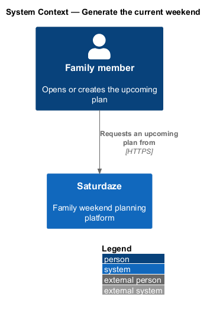
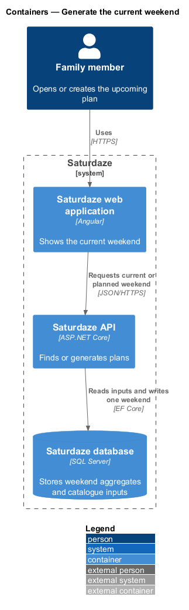
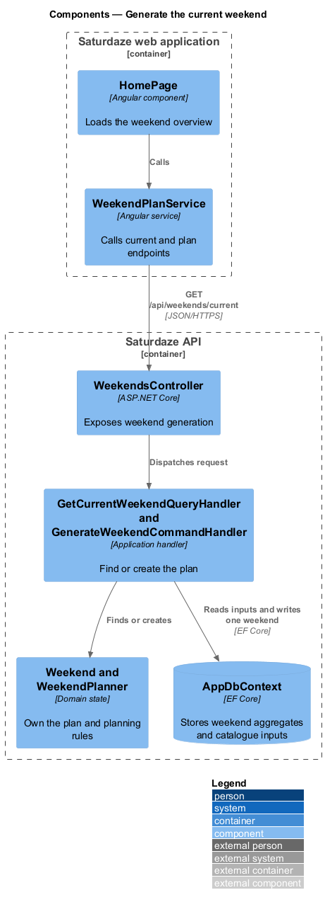
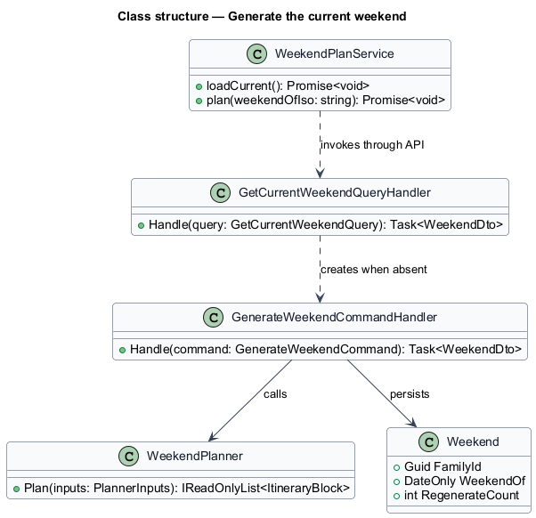
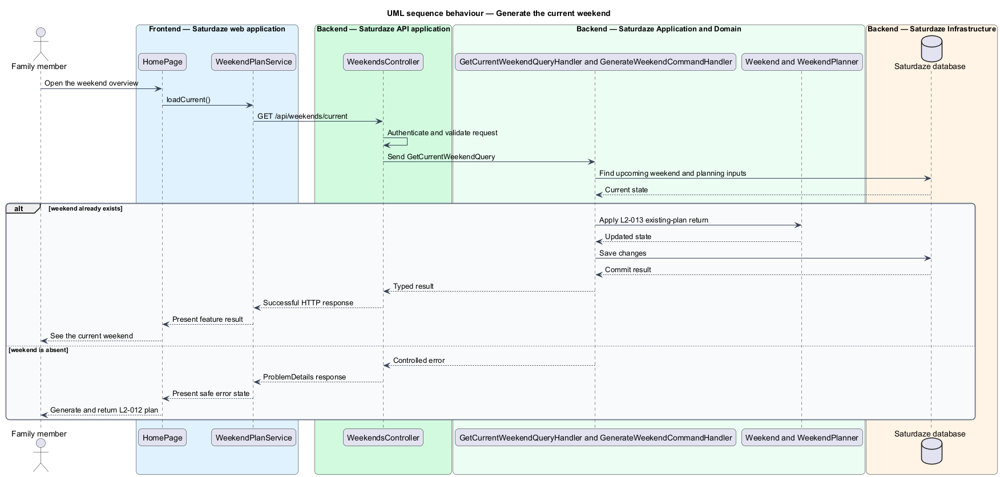

# Generate the current weekend

## Overview

Saturdaze is a web application that plans personalized family weekends. Weekend generation assembles Saturday and Sunday into one persisted plan tailored to the family profile, catalogue, history, and forecast.

*current weekend* — existing or on-demand plan for the current or next upcoming Saturday

`GetCurrentWeekendQueryHandler` returns the plan for the upcoming Saturday and delegates creation when none exists. `GenerateWeekendCommandHandler` gathers planner inputs and persists one `Weekend` per family and date.

## Description

The feature forms a vertical slice across the Angular application, the ASP.NET Core API, application handlers, domain state, and SQL Server persistence.

- **`HomePage`** — Angular weekend overview that loads the current plan.
- **`WeekendPlanService`** — Typed client service exposing `loadCurrent()` and `plan()`.
- **`WeekendsController`** — API controller exposing current and plan endpoints.
- **`GetCurrentWeekendQueryHandler`** — Application handler that finds or creates the upcoming plan.
- **`GenerateWeekendCommandHandler`** — Application handler that loads inputs and persists the new aggregate.
- **`WeekendPlanner`** — Deterministic planning service that creates blocks for both days.

## Requirements

The feature realizes the following level-2 (L2) requirements. Each row cites the level-1 (L1) capability refined by the requirement.

| L2 ID | Refines (L1) | Requirement |
|-------|--------------|-------------|
| `L2-012` | `L1-003` | `POST /api/weekends/plan` must create a new `Weekend` row for the requested weekend date with blocks across Saturday and Sunday, including activities, meals, drives, downtime, and any commitments from the family profile. |
| `L2-013` | `L1-003` | `GET /api/weekends/current` must return the family's plan for the current or next upcoming Saturday, generating one on demand if absent. |

## Diagrams

### System context

The context view identifies the family member using the capability and the Saturdaze system that owns the weekend state.

### Containers

The container view follows the interaction from the Angular web application through the API to SQL Server.

### Components

The component view names the page, client service, controller, handler, domain type, and persistence boundary involved in the slice.

### Class structure

The class view shows the request path and the state relationships used by the feature.

### Behaviour — load or generate the current weekend

The sequence view traces the primary behaviour to `L2-012` and `L2-013`. Its alternate path preserves valid existing state when the request cannot proceed.

