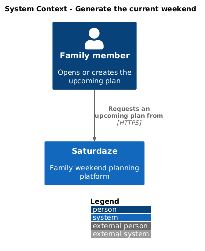
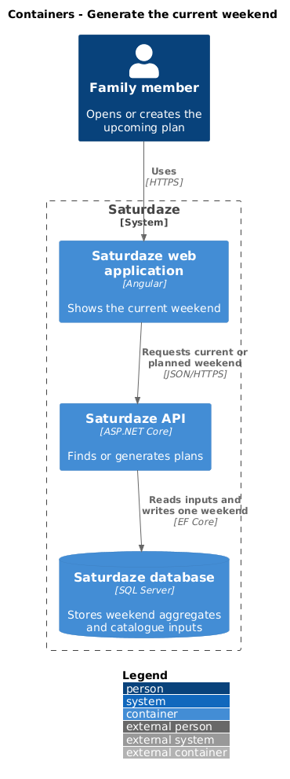
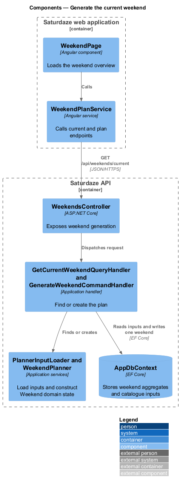
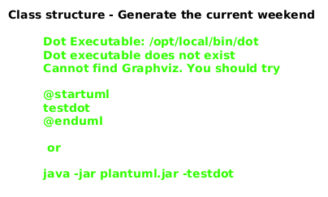
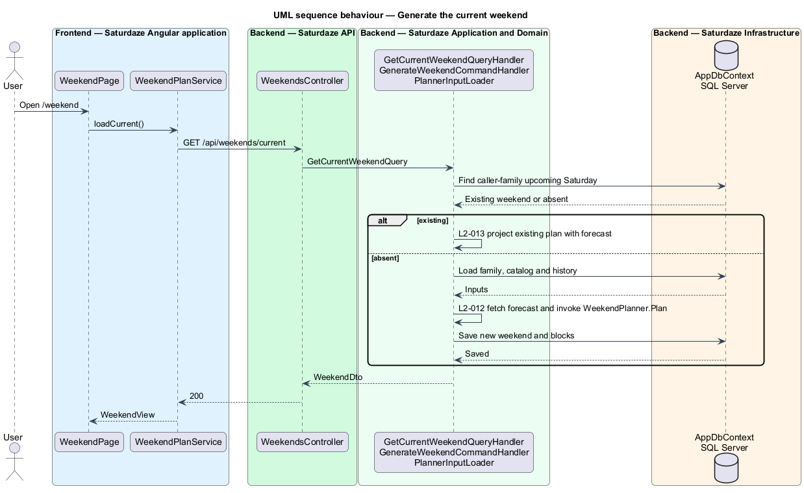
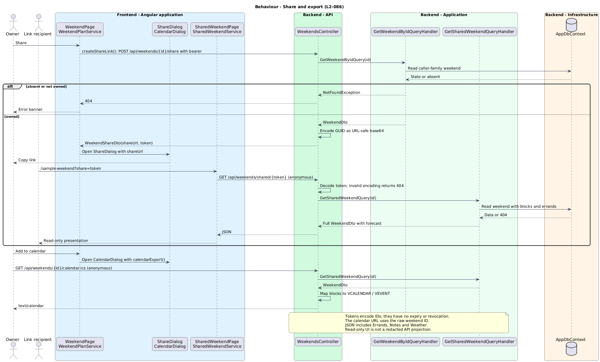

# Generate the current weekend

## Overview

Saturdaze is a web application that plans personalized family weekends. Weekend generation assembles Saturday and Sunday into one persisted plan tailored to the family profile, catalogue, history, and forecast.

*current weekend* — existing or on-demand plan for the current or next upcoming Saturday

`GetCurrentWeekendQueryHandler` returns the plan for the upcoming Saturday and delegates creation when none exists. `GenerateWeekendCommandHandler` gathers planner inputs and persists one `Weekend` per family and date.

## Description

`WeekendPage` reads `WeekendPlanService.getWeekend(): Signal<WeekendView>`. `loadCurrent()` calls `GET /api/weekends/current`; `plan(weekendOfIso)` explicitly requests a date.

`GetCurrentWeekendQueryHandler` resolves the upcoming Saturday using `IDateTimeProvider.Today`, defaulting to America/Toronto in the API. It returns the owned plan or dispatches generation.

`GenerateWeekendCommandHandler` resolves family ownership, uses `PlannerInputLoader` for family, catalog, forecast, and historical activity inputs, and persists one Weekend for each family/date.

`WeekendPlanner.Plan()` creates Saturday and Sunday blocks around commitments, meal windows, drives, downtime, and available activities. `WeekendForecastService` supplies configured-coordinate forecasts.

`WeekendPage.share()` calls `WeekendPlanService.createShareLink()`, which posts to the owner-scoped share endpoint, and opens `ShareDialog` with the returned URL. `SharedWeekendPage` reads `/api/weekends/shared/{token}` through `SHARED_WEEKEND_SERVICE` from `/sample-weekend?share=...`. `CalendarDialog` exposes the anonymous `/api/weekends/{id}/calendar.ics` URL, keyed by the weekend ID rather than the share token. The shared handler returns the full WeekendDto, not a redacted DTO.

## Requirements

The following L2 requirements refine the cited L1 capabilities. Implementation gaps stated in Description do not waive these obligations.

| L2 ID | Refines (L1) | Requirement |
|-------|--------------|-------------|
| `L2-012` | `L1-003` | `POST /api/weekends/plan` shall create a new `Weekend` row for the requested weekend date with blocks across Saturday and Sunday, including activities, meals, drives, downtime, and any commitments from the family profile. |
| `L2-013` | `L1-003` | `GET /api/weekends/current` shall return the family's plan for the current or next upcoming Saturday, generating one on demand if absent. |
| `L2-086` | `L1-003`, `L1-012` | An authenticated owner shall be able to create a read-only weekend share link. The shared-weekend and calendar endpoints shall accept anonymous capability URLs and return a weekend representation for read-only consumption. |

## Diagrams

### System context

The context view identifies the family member using the capability and the Saturdaze system that owns the weekend state.

### Containers

The container view follows the interaction from the Angular web application through the API to SQL Server.

### Components

The component view names the page, client service, controller, handler, domain type, and persistence boundary involved in the slice.

### Class structure

The class view shows the request path and the state relationships used by the feature.

### Behaviour — load or generate the current weekend

The sequence view traces the primary behaviour to `L2-012` and `L2-013`. Its alternate path preserves valid existing state when the request cannot proceed.

### Behaviour — share a weekend and export its calendar

This sequence records the current implementation, including its failure boundary.

