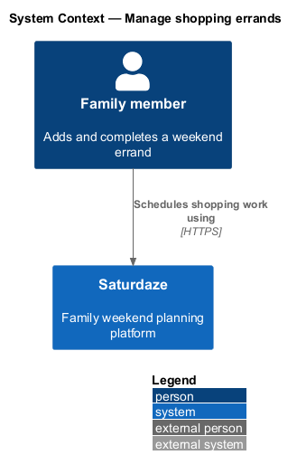
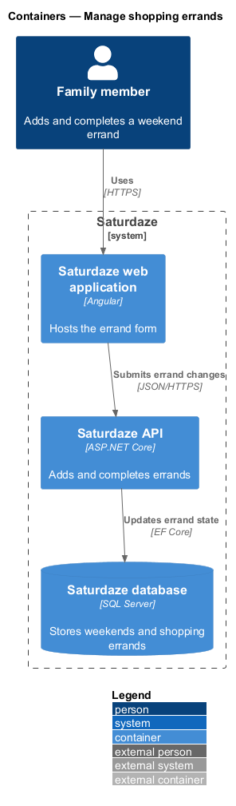
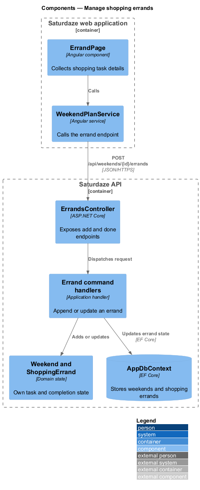
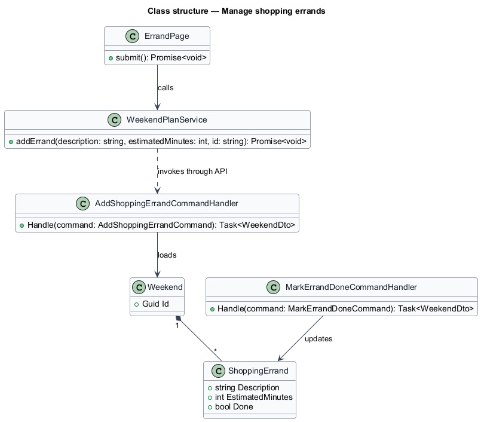
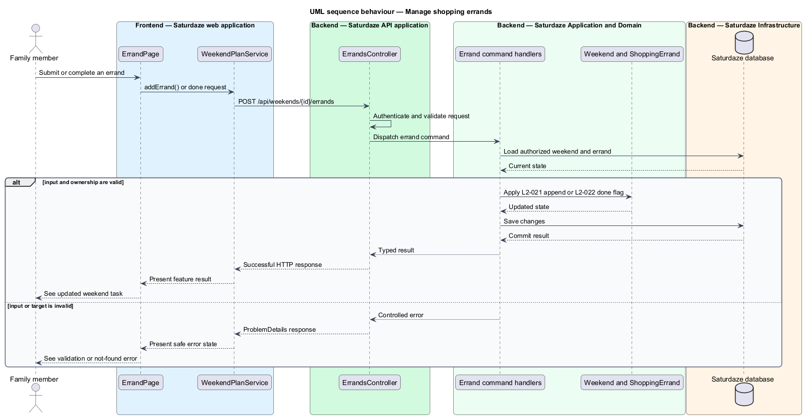

# Manage shopping errands

## Overview

Saturdaze is a web application that plans personalized family weekends. Errand management records a shopping task against a weekend and tracks whether the task is complete.

*shopping errand* — weekend task with a description, estimated duration, and completion flag

`ErrandPage` collects the task and duration. The API appends `ShoppingErrand` to the authorized weekend and returns the refreshed aggregate.

## Description

The feature forms a vertical slice across the Angular application, the ASP.NET Core API, application handlers, domain state, and SQL Server persistence.

- **`ErrandPage`** — Angular page that captures description, duration, and preferred day presentation.
- **`WeekendPlanService`** — Typed client service whose `addErrand()` method calls the weekend endpoint.
- **`ErrandsController`** — API controller exposing add and done operations.
- **`AddShoppingErrandCommandHandler`** — Application handler that appends a validated errand.
- **`MarkErrandDoneCommandHandler`** — Application handler that changes the completion flag.
- **`Weekend and ShoppingErrand`** — Domain aggregate and owned task state.

## Requirements

The feature realizes the following level-2 (L2) requirements. Each row cites the level-1 (L1) capability refined by the requirement.

| L2 ID | Refines (L1) | Requirement |
|-------|--------------|-------------|
| `L2-021` | `L1-008` | `POST /api/weekends/{weekendId}/errands` must append a `ShoppingErrand` to the weekend and return the updated `WeekendDto`. |
| `L2-022` | `L1-008` | `PUT /api/errands/{id}/done` must set the errand's `Done` field to the request value. |

## Diagrams

### System context

The context view identifies the family member using the capability and the Saturdaze system that owns the weekend state.

### Containers

The container view follows the interaction from the Angular web application through the API to SQL Server.

### Components

The component view names the page, client service, controller, handler, domain type, and persistence boundary involved in the slice.

### Class structure

The class view shows the request path and the state relationships used by the feature.

### Behaviour — add or complete an errand

The sequence view traces the primary behaviour to `L2-021` and `L2-022`. Its alternate path preserves valid existing state when the request cannot proceed.

