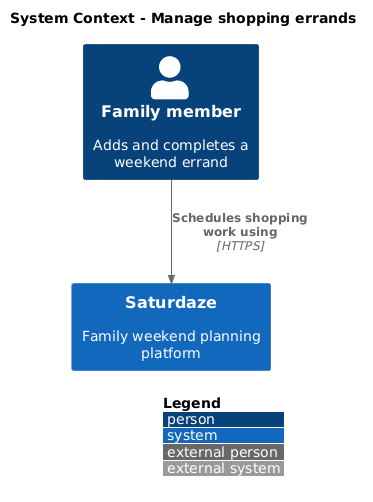
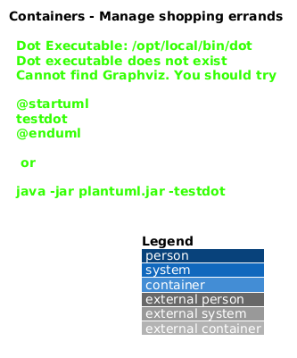
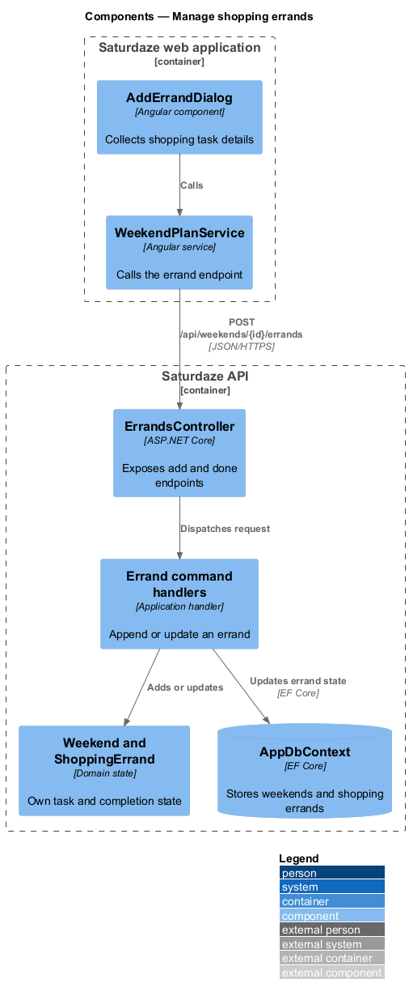
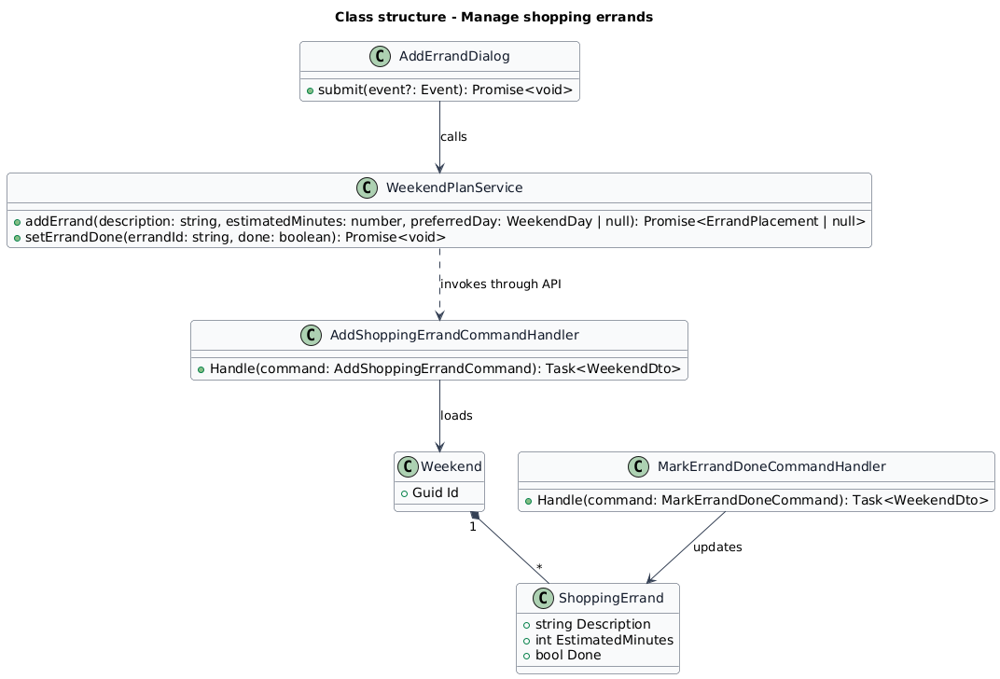
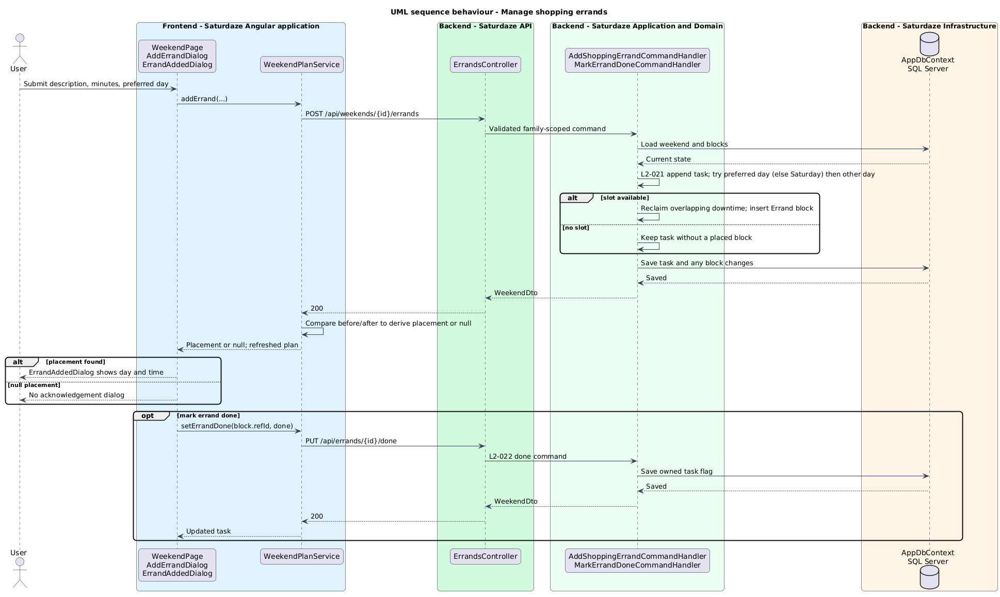

# Manage shopping errands

## Overview

Saturdaze is a web application that plans personalized family weekends. Errand management records a shopping task against a weekend and tracks whether the task is complete.

*shopping errand* — weekend task with a description, estimated duration, and completion flag

`AddErrandDialog` collects the task, duration and preferred day. The API appends `ShoppingErrand` to the caller's weekend, places an `Errand` block in the best free slot via `IWeekendPlanner.PlaceErrand` (preferred day first, existing downtime reclaimed, remaining gaps re-filled), and returns the refreshed aggregate.

## Description

`WeekendPage` opens `AddErrandDialog` to collect description, duration, and optional preferred day. The dialog calls `WeekendPlanService.addErrand()` through `WEEKEND_PLAN_SERVICE`, which posts those values and compares returned blocks with prior state to derive an `ErrandPlacement`. The dialog closes with that placement or `null`.

`ErrandsController` dispatches `AddShoppingErrandCommand`. The handler verifies family ownership, creates ShoppingErrand, and calls `IWeekendPlanner.PlaceErrand()` on the preferred day followed by the other day. Without a preferred day, Saturday is tried first.

Successful placement replaces overlapping downtime and fills remaining gaps. If neither day has space, the errand still persists without an itinerary block; the client can receive null placement.

`ErrandAddedDialog` acknowledges a non-null placement on the existing weekend screen. A `null` placement opens no dialog, so the no-slot indication in L2-021 is not implemented. `setErrandDone()` calls the done endpoint and `MarkErrandDoneCommandHandler` updates the owned errand.

Placement identifies the new block by comparing IDs and description; the API returns WeekendDto rather than a separate placement contract.

## Requirements

The following L2 requirements refine the cited L1 capabilities. Implementation gaps stated in Description do not waive these obligations.

| L2 ID | Refines (L1) | Requirement |
|-------|--------------|-------------|
| `L2-021` | `L1-008` | `POST /api/weekends/{weekendId}/errands` shall append a `ShoppingErrand` to the weekend, place an `Errand` block in the best free slot (the optional `preferredDay` first, then the other day; existing downtime is reclaimed), and return the updated `WeekendDto`. |
| `L2-022` | `L1-008` | `PUT /api/errands/{id}/done` shall set the errand's `Done` field to the request value. |

## Diagrams

### System context

The context view identifies the family member using the capability and the Saturdaze system that owns the weekend state.

### Containers

The container view follows the interaction from the Angular web application through the API to SQL Server.

### Components

The component view names the page, client service, controller, handler, domain type, and persistence boundary involved in the slice.

### Class structure

The class view shows the request path and the state relationships used by the feature.

### Behaviour — add or complete an errand

The sequence view traces the primary behaviour to `L2-021` and `L2-022`. Its alternate path preserves valid existing state when the request cannot proceed.

