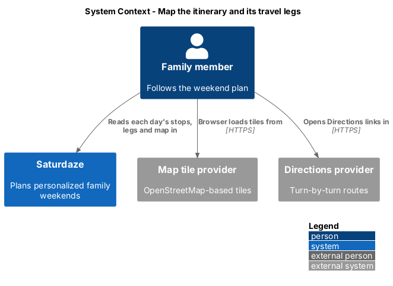
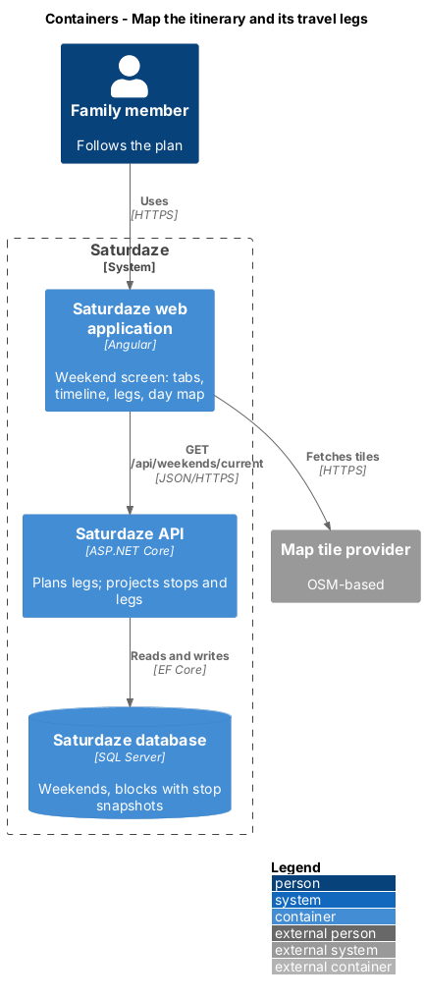
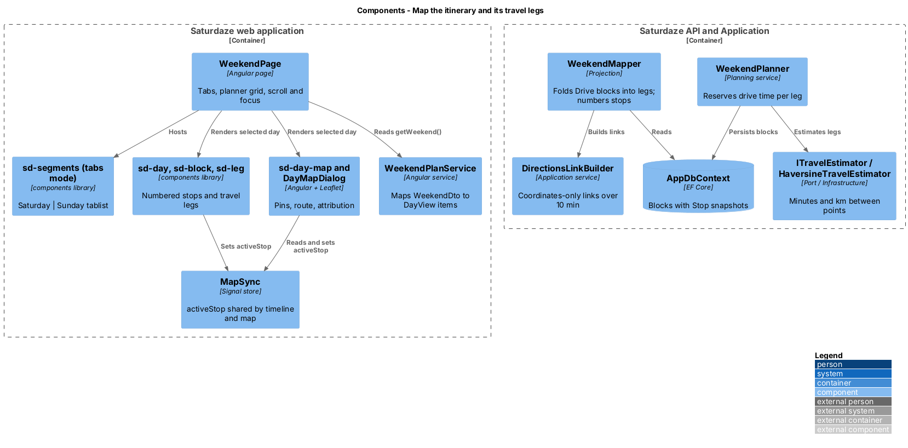
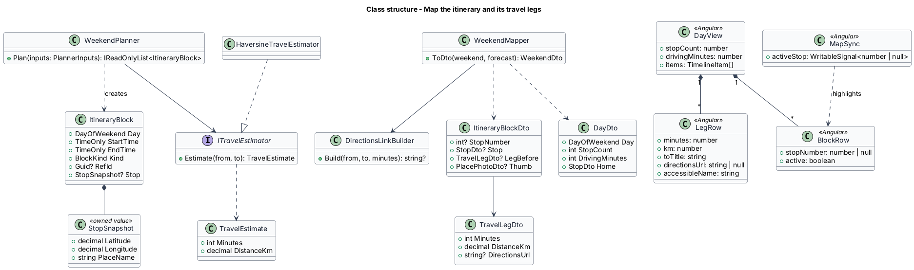
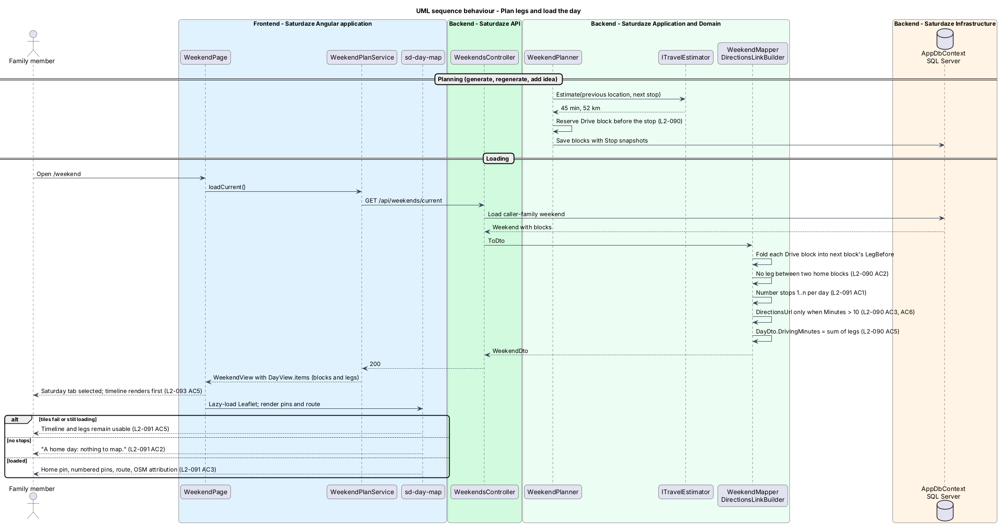
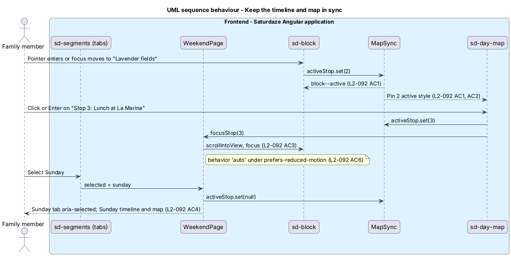

# Map the itinerary and its travel legs

## Overview

Saturdaze is a web application that plans personalized family weekends. The Weekend screen (`/weekend`) shows the plan for the current weekend. Before this feature it set Saturday and Sunday side by side and showed driving as standalone "Drive to …" blocks, with no sense of where the day goes.

*stop* — itinerary block at a location other than home

*stop number* — 1-based position of a stop in time order within its day

*travel leg* — drive between two consecutive blocks at different locations, with its minutes, kilometres, and an optional directions link

*day map* — map of one day showing the home pin, a numbered pin per stop, and the route through them in order

*active stop* — stop that the pointer, keyboard focus, or a pin activation currently highlights in both the timeline and the map

This feature reshapes the Weekend screen to `docs/mocks/pages/weekend.html`: Saturday | Sunday tabs show one day at a time; the day's timeline numbers its stops and shows a travel leg between them; the day map sits beside the timeline from 1024 px and above it, at 4:3, below 1024 px. The map is supplementary: every fact on it is also in the timeline. Coordinates come from `discovery/store-place-location-and-imagery`. The cover above the tabs is `weekend-planning/choose-weekend-cover-photo`.

## Description

### Planner and legs

`ItineraryBlock` gains a nullable `Stop` (`GeoLocation`: `Latitude`, `Longitude`, `Address`), and `Weekend` gains `Home`, the family's home when the weekend was planned (`Family.HomeCoordinates`, else `HomeLocationOptions`). `WeekendPlanner` copies it from the referenced catalog place when it creates an `Activity` or restaurant `Meal` block, and from an errand's chosen store when one exists. Home blocks (`Downtime`, home meals) have no `Stop`. A snapshot, rather than a lookup at read time, keeps past weekends stable when the catalog changes.

`TravelEstimator` estimates road distance as great-circle distance times a road factor of 1.3, and drive time at 50 km/h; both values are assumptions to revisit when a routing provider is chosen. `WeekendPlanner` continues to schedule drive time as `Drive` blocks from each activity's `DriveMinutes` (L2-102), so locks, regeneration, and calendar export keep working unchanged.

`ItineraryTravel.Build` walks each day in order. A block with a `Stop` is a numbered stop; downtime and home meals are at home; commitments and errands have no known place and leave the journey where it was. Where the place changes it emits a `TravelLegDto(Minutes, DistanceKm, DirectionsUrl?)` on the block's new `LegBefore` field, using the scheduled drive minutes in between, else the estimate. `WeekendMapper` still returns `Drive` blocks; clients hide them and render the legs. No leg is emitted between two home blocks (L2-102 AC2). `ItineraryBlockDto` also gains `StopNumber?` and `Stop?` (`LocationDto`). `WeekendDto` gains `Days` (`DayDto`: `Day`, `StopCount`, `DrivingMinutes` as the sum of that day's legs per L2-102 AC5, `DrivingKm`) and `Home`.

`DirectionsLinkBuilder` produces `DirectionsUrl` only for legs over 10 minutes (L2-102 AC3). The URL carries only the two coordinate pairs and travel mode, never a family, weekend, or block identifier (L2-102 AC6). It uses Google Maps' public `dir/?api=1` URL scheme, which needs no key.

Commitments have no place today. The mock numbers "Swim lessons" and "Church" as stops, so `Commitment` gains an optional `GeoLocation`, entered in `CommitmentDialog`. Until a commitment has one, it renders without a stop number and without legs around it.

### Weekend screen

`WeekendPage` keeps reading `WeekendPlanService.getWeekend(): Signal<WeekendView>`. Its template becomes: `sd-cover`, the cover actions, `sd-segments` in tab mode, and one `.planner` grid holding the selected `sd-day` and `sd-day-map`.

`sd-segments` gains a `mode` input (`nav` default, `tabs`) and a `selected` model. In tab mode it renders `role="tablist"` with `role="tab"` buttons, `aria-selected`, `aria-controls`, and arrow-key roving focus (L2-104 AC4). Saturday is selected when the screen opens; one day's timeline and map show at a time (L2-105 AC5).

`DayView` gains `stopCount`, `drivingMinutes`, `home`, and `items: readonly TimelineItem[]`, where `TimelineItem` is `BlockRow | LegRow`. `BlockRow` gains `stopNumber`, `stop`, and `thumb`. `LegRow` holds `minutes`, `km`, `toTitle`, `directionsUrl`, and the accessible name "Travel: {minutes} minutes, {km} kilometres to {next block}" (L2-102 AC4). The day meta reads "{date} · {high}° / {low}° · {n} stops · {driving} driving".

`sd-block` gains a `stopNumber` input; when set, the disc renders the number with `block__disc--num` instead of the icon (L2-103 AC1), and an `active` input that adds `block--active`. It emits `activeChange` on pointer enter, pointer leave, focus in, and focus out. The numbered disc uses `--colorBrandBackground` with `--colorNeutralForegroundOnBrand`, a pair that meets 4.5:1, and its ring meets 4.5:1 against the page (L2-103 AC4).

`sd-leg` is a new component for `.leg`: a rail, the car icon, "{minutes} min · {km} km", and the "Directions" link with `target="_blank"` and `rel="noopener"`.

`sd-day-map` is a new component in the app (it depends on a map library, so it stays out of `components`). It renders an `<aside>` landmark labelled "{Day} map" (L2-104 AC5), a Leaflet map with OpenStreetMap-based tiles and their attribution always visible (L2-103 AC3), a home pin, a `<button>` pin per stop named "Stop {n}: {title}", and a dashed route polyline in stop order. A day with no stops renders "A home day: nothing to map." instead (L2-103 AC2). The legend repeats stop count, driving time, and kilometres. The tile provider and its usage terms are `<TO SUPPLY>`; Leaflet loads lazily so the timeline renders first and stays usable while tiles load or fail (L2-103 AC5).

`MapSync` is a small signal store provided by `WeekendPage`: `activeStop: WritableSignal<number | null>`. Block hover or focus sets it, which gives the pin its active style (L2-104 AC1, AC2). A pin activation sets it and asks `WeekendPage` to scroll the block into view and focus it (L2-104 AC3). Scrolling, panning, and zooming use `behavior: 'auto'` under `prefers-reduced-motion: reduce` (L2-104 AC6).

### Layout

`weekend.page.scss` defines `.planner` as one `minmax(0, 1fr)` column below 1024 px with the map first, and two equal columns from 1024 px with the map `position: sticky` below the top bar (L2-105 AC1, AC2). Below 1024 px an "Open map" `sd-button` opens `DayMapDialog`, a full-screen CDK dialog that hosts the same `sd-day-map`. The page bottom keeps the ADR-005 clearance so the bottom nav never covers the last row (L2-105 AC4). The old `.sd-grid-days` rules are removed; L2-028 is revised to match.

## Requirements

The following L2 requirements refine the cited L1 capabilities.

| L2 ID | Refines (L1) | Requirement |
|-------|--------------|-------------|
| `L2-102` | `L1-035` | Between two consecutive blocks at different locations, the Weekend timeline shall render a travel leg (`.leg`) showing drive time and distance, plus a "Directions" link to an external maps provider for legs longer than 10 minutes. Legs replace the standalone "Drive to …" blocks of the earlier two-day Weekend mock. The planner shall compute legs from coordinates (L2-099) and shall continue to schedule drive time. |
| `L2-103` | `L1-035` | Each block with a location other than home shall be numbered in time order within its day (1, 2, 3, …); the number replaces the block's icon disc. The day map shall show the home pin, one numbered pin per stop, and the route through them in order. Map tiles shall come from an OpenStreetMap-based provider with its required attribution visible. |
| `L2-104` | `L1-035` | Hovering or focusing a numbered stop shall highlight its pin, and activating a pin shall scroll to, highlight, and focus its stop in the timeline. Switching the day (Saturday \| Sunday tabs) shall swap both the timeline and the map. The map shall be supplementary: everything it shows shall also be available in the timeline. |
| `L2-105` | `L1-035`, `L1-011` | The Weekend layout shall follow `docs/mocks/pages/weekend.html`. The screen shows one day at a time; the Saturday \| Sunday tabs (L2-104) switch between them. |
| `L2-028` | `L1-011` | Every routed page (`/`, `/weekend`, `/ideas`, `/ideas/food`, `/ideas/events`, `/past`, `/family`, `/review-submissions`, `/legal`, `/sample-weekend`, all auth pages) shall render usably at viewport widths 320 px, 390 px, 820 px, 1440 px, and 1920 px. |

## Diagrams

### System context

The context view adds the two external services the Weekend screen now reaches from the browser: the map tile provider and the directions provider.

### Containers

The container view shows legs computed in the API and the map drawn in the browser from tiles the browser fetches directly.

### Components

The component view names the planner port and mapper on the server, and the page, timeline, leg, map, and sync store in the browser.

### Class structure

The class view shows the stop snapshot on `ItineraryBlock`, the travel estimator port, and the DTO and view types that carry legs and stop numbers.

### Behaviour — plan legs and load the day

The planner reserves drive time from estimated legs, and the mapper folds `Drive` blocks into legs and numbers the stops (`L2-102`, `L2-103`).

### Behaviour — keep the timeline and map in sync

This browser-only sequence covers hover, focus, pin activation, and switching the day (`L2-104`).

